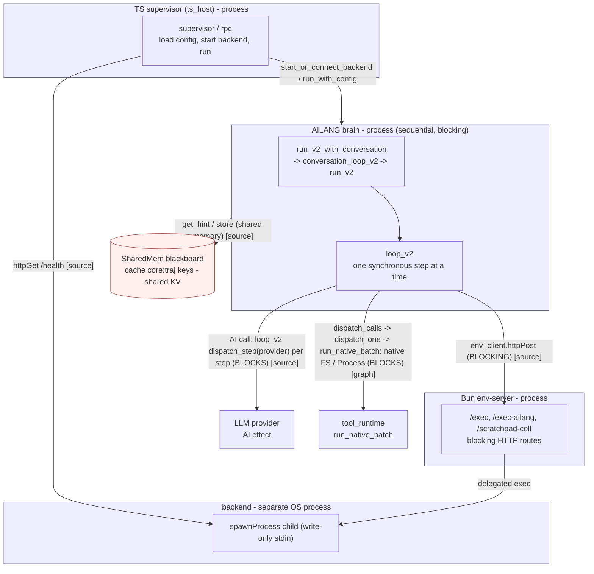
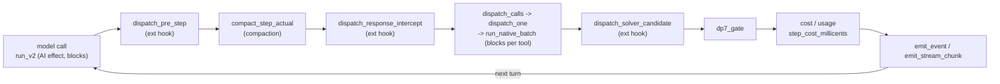
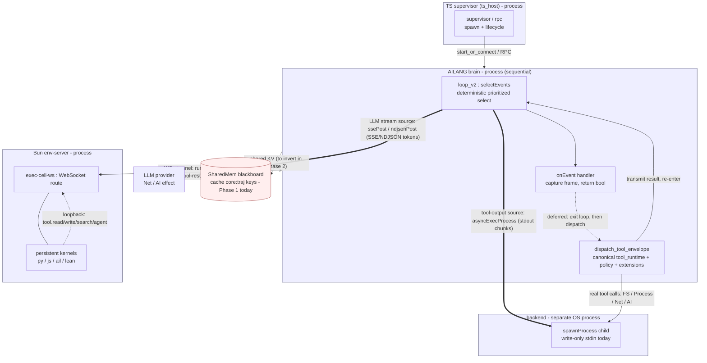
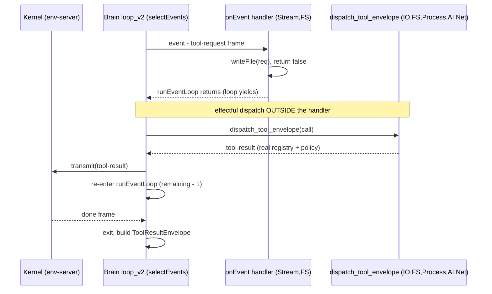
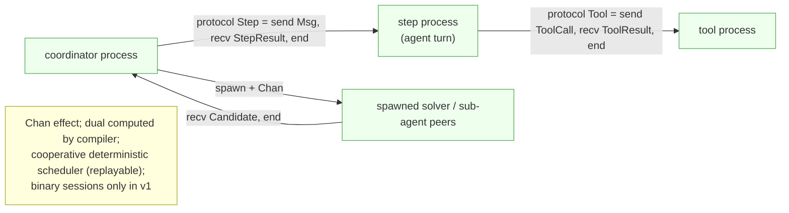

# Diagram: a possible CSP architecture for Motoko's core

Companion to [RESEARCH-csp-core-feasibility.md](./RESEARCH-csp-core-feasibility.md). These are
*proposals*, grounded in what ships today (`std/stream` `selectEvents` + the shipped
`motoko_scratchpad/ws_loopback.ail` re-entrant loop) and what's planned (v1.0.0
`m-csp-session-types`). Boxes are **processes** (sequential inside, communicating only by
messages); edges are **channels** labelled with their message/protocol.

**§0 is the current architecture (baseline); §1–§3 are the CSP proposals.**

---

## 0. Current architecture (today, v0.26.0) — baseline for comparison

How the core runs **now**. Same convention: boxes = processes, edges = channels. The defining
trait vs. the CSP proposals: the brain is a **strictly sequential, blocking** loop — one step at a
time, each effect (AI call, tool subprocess, env-server request) **blocks to completion**. There is
no `selectEvents` multiplexer; cross-agent state is a shared `SharedMem` blackboard, not messages.

**Grounding (verified 2026-06-30):** the entry chain, the `loop_v2` invoke set, and the
`AI`-effect attribution are **code-graph** facts (`q callers loop_v2`; `invokes`/`effects`
tables — note the graph was STALE and call/effect edges are source-parsed *approximations*). The
stdlib call sites (`httpPost` routes, `httpGet /health`, `_sharedmem_get`/`get_hint`) are
**source-grounded** (grep), not from the graph. (a) The per-step pipeline **ordering** is *inferred*
(`invokes` is an unordered set). (b) **Correction (source-verified):** the model call **is** per
step — `loop_v2` makes the blocking `dispatch_step(provider, …)` call inside its recursion and
**carries the `AI` effect** (`agent_loop_v2.ail:1125`). Code-graph wrongly attributed `AI` only to
`run_v2`/`conversation_loop_v2` because `dispatch_step` is a `StepProvider`-record call its parser
didn't resolve — a concrete example of the "edges are approximations" caveat.

A per-turn chain spanning `run_v2` (the blocking model call) and `loop_v2` (everything else) — a
**linear, blocking** flow, contrast with the CSP `selectEvents` multiplexer in §1. **Node
membership is code-graph (`loop_v2` invokes + `run_v2` AI effect); the left-to-right *order* is
inferred — code-graph does not sequence `invokes`.**

**Current vs. CSP (what actually changes):**

| Concern | Current (today) | CSP proposal (§1–§3) |
|---|---|---|
| Brain concurrency | sequential, one step at a time | single `selectEvents` over many async sources |
| LLM call | blocking `AI` effect on `run_v2` (`std/ai`; `ai_compat` is a defined-but-unused shim) | `ssePost`/`ndjsonPost` token source, multiplexed |
| Tool exec | native `tool_runtime` Process, blocking | `asyncExecProcess` source / canonical re-entrant dispatch |
| Brain ↔ env-server | blocking `httpPost` (request/response) | bidirectional WebSocket channel |
| Cross-agent state | `SharedMem` blackboard (shared memory) | typed channel messages (Phase 2) |
| Internal seams (tool/RPC/hooks) | convention-only contracts | session-typed protocols (Phase 2) |
| Determinism | sequential ⇒ deterministic | deterministic `selectEvents` / scheduler (preserved) |

> Note: `motoko_scratchpad/ws_loopback.ail` (the shipped re-entrant WS loop, §2) already lives
> *beside* this baseline as a feature-flagged path — the CSP proposal is to make that loop shape
> the core's organizing principle rather than one extension's opt-in.

---

## 1. System view — processes communicating over channels

Each OS process is a CSP "process": sequential internally, isolated, talking only over channels.
Phase 1 channels are `std/stream` WebSockets + async sources (shipped). Phase 2 promotes the
*internal* seams to session-typed `Chan` (v1.0.0).

**Reading it:** the brain is one sequential process whose *concurrency* is a single
`selectEvents` multiplexing many async sources (LLM token stream, tool output, control). Effectful
tool dispatch goes through the canonical `dispatch_tool_envelope` — and (per the shipped precedent)
happens **after** the handler yields, not inside it. Kernels and the backend live in their own
processes; the only cross-process coupling is channels.

---

## 2. The re-entrant dispatch cycle (deferred — as shipped)

This is `motoko_scratchpad/ws_loopback.ail`'s `loop_until_done`, generalised: capture in the
handler, **exit** the loop, run the effect in the enclosing sequential context (so errors surface),
`transmit`, re-enter. Bounded by a depth/iteration cap.

> Inline alternative (handler does the dispatch itself) is **verified possible** on v0.26.0
> (smokes, §5) but **not** what production chose — deferred surfaces effect errors that a handler
> would swallow (process still exits 0). See RESEARCH §4, §6.

---

## 3. Phase 2 — session-typed channels (v1.0.0 `m-csp-session-types`)

Promote the convention-only internal seams to **typed channels** with compile-time protocol
checking, and replace the SharedMem blackboard with message passing. `spawn` turns sub-agents /
solvers into real in-language peer processes instead of I/O sources.

---

## Legend / grounding

- **Solid `==>`** = `std/stream` async source (shipped). **`<-->`** = bidirectional WebSocket
  channel (shipped). **Dotted** = deferred / to-be-changed.
- **Phase 1 (today, v0.26.0):** §1 + §2 are buildable now — they generalise shipped code
  (`selectEvents`, `ws_loopback.ail`). No language dependency.
- **Phase 2 (v1.0.0):** §3 needs the unshipped `Chan` effect + session types.
- Hard constraints still apply (RESEARCH §7): no persistent bidirectional subprocess in-brain
  (peers are external until `spawn`), cooperative not parallel, binary sessions only.
