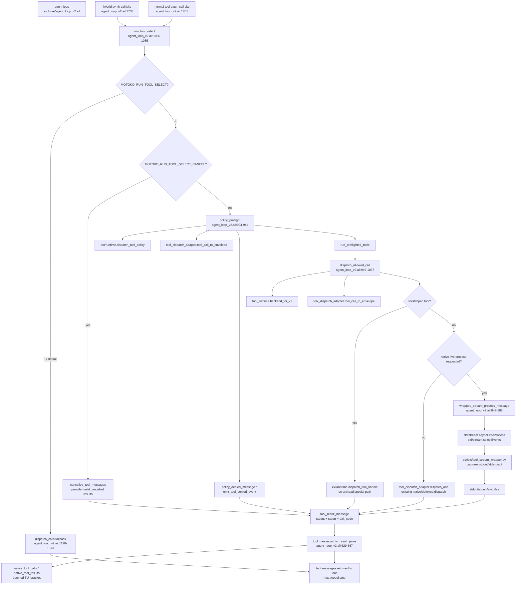

# Diagram: Phase-1 `run_tool_select` core architecture

Grounded in the refreshed `tools/code-graph` core profile from 2026-07-01:
25/25 modules extracted successfully; graph and source index were not stale.
Call/effect rows are source-parsed approximations, so this diagram uses code-graph
for module/function edges and source-index line anchors for concrete locations.

## Code-Graph Grounding

- `run_tool_select` is called from both tool-phase sites:
  `src/core/agent_loop_v2.ail:1738` for the hybrid synthesized call and
  `src/core/agent_loop_v2.ail:1851` for normal `result.tool_calls`.
- `run_tool_select` invokes `policy_preflight`, `run_preflighted_tools`,
  `cancelled_tool_messages`, and fallback `dispatch_calls`.
- `dispatch_allowed_call` invokes `tool_runtime.backend_for_v2`,
  `tool_dispatch_adapter.dispatch_one`, `tool_dispatch_adapter.tool_call_to_envelope`,
  `ext/runtime.dispatch_tool_handle`, and `wrapped_stream_process_message`.
- `wrapped_stream_process_message` is the current `std/stream` node; code-graph
  records calls to `std/stream.asyncExecProcess` and `std/stream.selectEvents`.
- Raw AILANG v0.26.0 `asyncExecProcess` does not surface stderr, so live process
  tools route through `scripts/tool_stream_wrapper.py` to preserve stdout, stderr,
  and exit-code fidelity.

