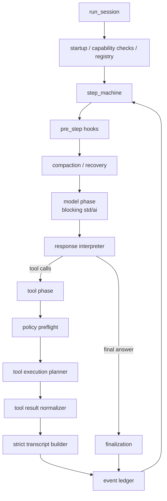
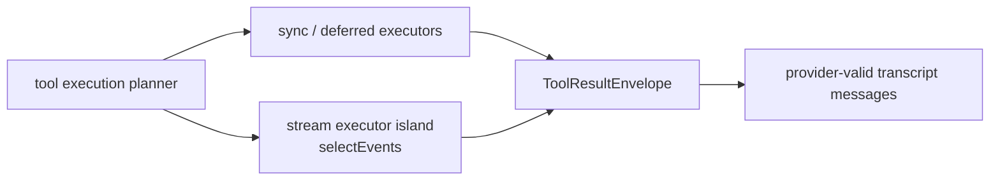

# Why CSP is not the right core architecture right now

Date: 2026-07-02
Status: Direction note after reverting the Phase-1 `run_tool_select` implementation
Toolchain considered: **AILANG v0.26.0** (commit `3b52a24`)

This note records why the project should not currently pursue CSP as the primary core architecture,
despite the CSP research being useful and the `std/stream` substrate being real. It is not a claim
that CSP is wrong permanently. It is a claim that, on AILANG v0.26.0 and given the project goal of
moving functionality from TypeScript into AILANG core, a CSP-first rewrite would spend too much
complexity budget fighting the substrate instead of improving the core's correctness.

This is a direction note after the implementation revert, not a rewrite of the historical ADR/plan
documents. Read it as superseding the current implementation direction for this branch: preserve the
research, do not continue the Phase-1 `run_tool_select` production path as the next architecture.

---

## Summary

The Phase-1 CSP work proved several useful things:

- `std/stream.selectEvents` exists and can multiplex stream sources.
- `asyncExecProcess(cmd, args, name, ...)` routes process output by source `name`, so
  `tool_call_id` can be used as a routing key.
- process exit code surfaces through `Closed(code, reason)`.
- the existing core has a plausible seam at the tool phase.

It also proved the more important negative result:

- raw `asyncExecProcess` does **not** surface stderr as stream data on v0.26.0.
- select handlers are too constrained to be a comfortable home for general effectful core dispatch.
- process-source cancellation is coarse; exiting `selectEvents` is the kill/reap boundary.
- deferred extension/scratchpad dispatch still has to run sequentially outside the select loop.
- the model call remains blocking `std/ai`, so the core cannot become a clean end-to-end CSP graph.

The reverted implementation was not a true CSP core. It was a CSP-shaped tool seam inside the
existing sequential loop. That seam was useful as a spike, but it is not the architecture we should
build around now.

---

## The core mismatch

CSP is strongest when the runtime gives us cheap, uniform, cancellable communicating processes:

- every long-running operation can become a source or process;
- all effects can be represented as messages;
- cancellation is a normal protocol event;
- each process can be supervised or killed independently;
- channel protocols can enforce ordering and completion;
- replay can record scheduler decisions and message delivery.

AILANG v0.26.0 does not yet provide that shape inside the language. It provides useful pieces, but
not enough to make CSP the simplest organizing principle for the whole agent core.

The current AILANG substrate is closer to:

```text
blocking model call
+ sequential effectful functions
+ limited stream multiplexer for selected I/O sources
+ coarse process-source teardown
+ runtime-checked JSON/frame conventions
```

That does not mean we cannot use streams. It means streams should be local implementation details for
specific phases, not the global architecture of the core.

---

## Specific substrate blockers

### 1. The model call is still blocking

The model step remains a blocking `std/ai` operation in v0.26.0. A true CSP core would naturally make
the model a source of token, tool-call, usage, and completion events. Raw streaming HTTP primitives
exist, but using them would bypass the existing `std/ai` provider abstraction; preserving that
abstraction keeps the model phase blocking. Moving orchestration out of AILANG would also solve this
mechanically, but that is explicitly not the long-term direction of this project.

If the model call remains blocking, the outer architecture is still:

```text
model step -> tool phase -> transcript update -> next model step
```

That is a step machine, not an end-to-end CSP network.

### 2. `asyncExecProcess` is not a complete process protocol

The substrate smokes found that `asyncExecProcess`:

- emits stdout as `SourceBytes`;
- uses the supplied `name` as the source identity;
- reports exit status through `Closed(code, reason)`;
- does not emit stderr as stream data.

Tool result fidelity requires stdout, stderr, exit code, and truncation metadata. Since stderr is
missing, a CSP process arm either has to:

- delegate such tools back to the existing backend, which reduces the CSP architecture to a partial
  special case; or
- introduce a wrapper protocol that captures stderr itself, which adds another ad hoc protocol layer.

The wrapper approach can work, but it is a workaround, not evidence that the substrate is ready to be
the core architecture.

### 3. Handler-side effects are possible, but risky

The research and smokes showed that selected effectful work can run inside live stream handlers:
`Net` and stubbed `AI` both worked in the local probes. That positive result matters. It means the
substrate is capable enough for experiments and small loopback protocols.

The same research also showed why handler-side dispatch is the wrong default for production core
logic. Missing caps or effect failures inside the handler can abort the handler, return from the
event loop, and still leave the process exiting 0 with little or no stderr. The safer production
pattern is to capture an event, exit the loop, run effectful dispatch in the enclosing sequential
context where failures surface normally, then re-enter if needed.

That pattern is valuable, but it is no longer the simple CSP story of "everything is a process
handling messages." It is a staged sequential interpreter with stream islands.

### 4. Cancellation is not fine-grained enough

For process sources, v0.26.0 does not provide a per-source kill primitive. Exiting `selectEvents` is
the process-source reap boundary. `disconnect` applies to `StreamConn`, not arbitrary process
sources.

That means a cancellation design must be shaped around whole-select teardown and synthetic results
for unfinished calls. This is workable for a tool streaming island, but it is not a strong foundation
for rewriting the entire core around independently supervised processes.

### 5. Deferred tools still cannot be naturally interleaved

Extension dispatch, scratchpad loopback, delegated tools, and policy approval all retain sequential
constraints:

- policy approval can block on stdin and must happen before any source starts;
- scratchpad has a special path and cannot be blindly routed through the generic envelope helper;
- deferred dispatch cannot be preempted cleanly once started;
- extension effects should not run inside the select handler.

So even the intended `run_tool_select` architecture had two separate stages:

```text
native concurrent stream stage
deferred sequential stage
```

That is not a clean CSP decomposition. It is a pragmatic phase split.

---

## Product and maintenance concerns

### CSP would hide the main correctness problem

The core's most expensive failure modes are not primarily "not concurrent enough." They are:

- invalid provider transcripts;
- missing or empty `tool_call_id`;
- tool results emitted in the wrong shape;
- scattered event emission;
- mixed responsibilities inside `agent_loop_v2.ail`;
- compaction/recovery behavior coupled to the main loop;
- unclear phase boundaries.

CSP does not automatically fix these. A strict transcript builder, explicit phase state machine, and
central event ledger would address them more directly.

### The implementation would become larger before it becomes simpler

The reverted Phase-1 implementation was intentionally small and flag-gated, but it still added:

- feature-flag pathing;
- policy preflight plumbing;
- per-tool capability flags;
- frame validators;
- cancellation synthesis;
- wrapper scripts;
- additional smokes;
- more complexity in `agent_loop_v2.ail`.

Even then, it only produced a CSP-shaped seam, not a true CSP core. Continuing would require more
state machinery, frame parsing, synthetic result logic, and cancellation cases. That complexity might
be justified later, but it is not the right first move for a rewrite.

### Moving orchestration to TypeScript is not acceptable

A host-runtime CSP kernel would be technically attractive because TypeScript/Bun can already manage
streams, subprocesses, timers, cancellation, and supervision well. But that goes against the project
direction: move functionality from TypeScript into AILANG core, not the other way around.

Therefore, the relevant question is not "what CSP architecture could TypeScript host for AILANG?"
The relevant question is "what architecture is optimal inside AILANG v0.26.0?" The answer is not
CSP-first.

---

## Recommended architecture instead

For AILANG v0.26.0, the better target is a **phase-oriented agent core**:

```text
deterministic turn/step state machine
+ explicit phase contracts
+ strict transcript builder
+ append-only event ledger
+ normalized tool/provider/hook envelopes
+ stream islands only where the substrate is strong enough
```

The outer shape should remain sequential by design:



This architecture better matches the substrate because every phase can be explicit about:

- what effects it may perform;
- what state it consumes;
- what state it produces;
- what events it emits;
- how failures become recoverable results.

Streaming still has a place, but as an executor strategy inside the tool phase:



That is a better fit than making streams the architecture.

---

## What to optimize for now

### 1. Split `agent_loop_v2.ail` by phase ownership

The current core file carries too many responsibilities. A rewrite should split by phase, not by
incidental helper type:

```text
src/core/session.ail
src/core/step_machine.ail
src/core/model_phase.ail
src/core/tool_phase.ail
src/core/tool_stream_phase.ail
src/core/hook_phase.ail
src/core/transcript.ail
src/core/ledger.ail
src/core/cost_phase.ail
src/core/recovery.ail
```

### 2. Make transcript construction a single gate

Provider-facing messages should only be built in one module. That module should enforce:

- no empty tool ids;
- exactly one tool result per tool call;
- original ids preserved;
- call-order output unless explicitly overridden;
- no live chunks in the model transcript;
- malformed tool/provider state becomes a valid error result, not an invalid transcript.

This boundary is more valuable than CSP today because it directly prevents provider 400/422-class
failures.

### 3. Use normalized envelopes between phases

Do not let every phase build raw provider JSON or raw UI events. Use internal envelopes:

```text
ModelEnvelope
ToolCallEnvelope
ToolResultEnvelope
HookResultEnvelope
LedgerEvent
TranscriptDelta
```

Then convert to provider messages and TUI events at controlled boundaries.

### 4. Centralize event emission

Scattered `emit_event` calls make replay and reasoning difficult. Prefer phase returns:

```text
PhaseResult {
  state_delta,
  transcript_delta,
  ledger_events,
  cost_delta,
  continuation
}
```

One place appends and emits events. That creates a migration path to deterministic replay without
requiring a full CSP scheduler today.

### 5. Keep stream execution as a contained island

Use `std/stream.selectEvents` where it is actually useful:

- native tools that need live stdout and do not require native stderr fidelity, or tools whose
  stderr/exit protocol has been explicitly wrapped and tested;
- WebSocket loopback patterns that are already proven;
- future provider streaming if the `std/ai` provider abstraction grows a source/event surface.

Do not make every hook, approval, deferred tool, model call, or memory operation a source just to
fit the architecture.

---

## Decision

Do not pursue CSP as the primary core architecture on AILANG v0.26.0.

Preserve the CSP research and substrate smokes as evidence. Keep `std/stream` as a tactical tool for
specific streaming phases. For the next rewrite, target a phase-oriented AILANG core with strict
transcript invariants, explicit phase results, an append-only ledger, and normalized envelopes.

This path better serves the project's long-term goal: moving functionality from TypeScript into
AILANG core while staying honest about what AILANG v0.26.0 can express cleanly today.
