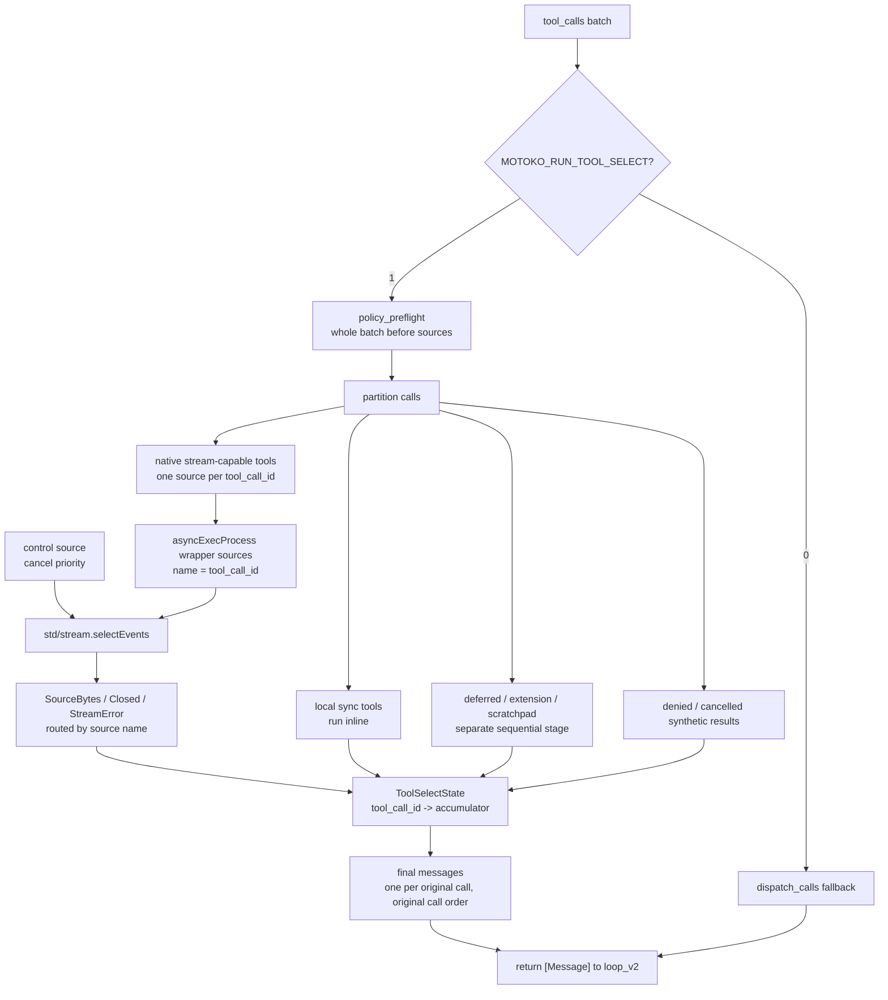

# Phase-1b implementation plan: make `run_tool_select` a real CSP tool phase

Date: 2026-07-01
Status: Draft delta plan
Pinned toolchain: **AILANG v0.26.0** (commit `3b52a24`)

Relates to:
- `PLAN-phase1-run-tool-select.md` — original accepted Phase-1 plan.
- `ADR-001-csp-core-phase1.md` — behavioral contracts and settled decisions.
- `DIAGRAM-phase1-run-tool-select-codegraph.md` — current implementation diagram grounded in the
  refreshed code graph.
- `scripts/tool_stream_wrapper.py` — current stderr/exit-code workaround for process streams.

---

## TL;DR

Phase 1 landed a useful seam, but not yet a true CSP-shaped tool phase. The current
`run_tool_select` path is flag-gated, policy-preflights the batch, preserves provider-valid
cancelled results, and has a `std/stream` wrapper path for live-process fidelity. But most execution
still flows through helper calls that return completed tool messages, so the tool phase is still
mostly sequential dispatch with a streaming special case.

Phase 1b makes the tool phase genuinely event-driven:

1. `run_tool_select` owns the whole tool batch lifecycle.
2. Stream-capable native tools become one `StreamSource` per `tool_call_id`.
3. A control/cancel source participates in the same `selectEvents` call.
4. Wrapper stdout frames become production input, not just a smoke artifact.
5. Result assembly moves into a per-call state machine keyed by `tool_call_id`.
6. Sync/deferred/scratchpad tools remain outside the native select where the substrate requires it.

This is still Phase 1: the model call remains blocking, hooks/compaction/cost stay untouched, no
`Chan`, no `spawn`, no in-brain LLM-as-source, and the old `dispatch_calls` fallback remains.

---

## Current State Correction

The code-graph-grounded current implementation is:

- `run_tool_select` is called at both tool phase sites:
  - `src/core/agent_loop_v2.ail:1738` hybrid synthesized call.
  - `src/core/agent_loop_v2.ail:1851` normal `result.tool_calls`.
- `run_tool_select` is defined at `src/core/agent_loop_v2.ail:1066-1085`.
- `dispatch_calls` fallback remains at `src/core/agent_loop_v2.ail:1128-1373`.
- `policy_preflight` exists at `src/core/agent_loop_v2.ail:904-944`.
- `dispatch_allowed_call` exists at `src/core/agent_loop_v2.ail:946-1037`.
- `wrapped_stream_process_message` exists at `src/core/agent_loop_v2.ail:849-888`.
- `tool_messages_to_result_jsons` exists at `src/core/agent_loop_v2.ail:629-667`.

This is best described as:

```text
CSP-shaped seam inside the existing sequential core, not yet a CSP tool phase.
```

The concrete gap: the select loop is not the owner of native tool output, cancellation, and result
assembly for a batch. A helper still returns a completed message for the wrapper path after reading
files. That preserves final fidelity but does not yet make `run_tool_select` the batch multiplexer.

---

## Target Architecture

Only the tool phase changes. The outer loop stays:

```text
blocking model step -> tool phase -> append tool results -> next model step
```

Inside `run_tool_select`, the batch becomes:



Substrate constraints remain load-bearing:

- Process source identity is the source `name`; use `tool_call_id`.
- Raw `asyncExecProcess` does not surface stderr on v0.26.0; wrapper frames carry stderr.
- `selectEvents` handler cannot run arbitrary effectful dispatch safely; deferred dispatch stays
  outside the native select.
- Exiting `selectEvents` is the reap boundary for process sources.
- `disconnect` is only available for `StreamConn`, not per-process `StreamSource`.

---

## Non-Goals

- Do not make the model call a stream source.
- Do not introduce `Chan`, session types, or `spawn`.
- Do not make approval a select source; keep policy/Pending preflight.
- Do not dispatch extension tools inside the select handler.
- Do not remove `dispatch_calls`; keep it as the flag-off fallback for at least this phase.
- Do not widen `parallel_safe` defaults broadly until parity is green.

---

## Work Breakdown

Each work item is intended to be independently revertible by flipping `MOTOKO_RUN_TOOL_SELECT=0`.
Land in order; do not flip the default until the Phase-1b parity target is green.

### WI-1b-0 — Refresh anchors and freeze current baseline

Re-run code-graph and source anchor checks immediately before editing.

- **Files touched:** none, except generated `tools/code-graph/.out` if refreshed.
- **Checks:**
  - `tools/code-graph/extract.sh`
  - `python3 tools/code-graph/query/cgq.py q failures`
  - Reconfirm the line anchors listed in "Current State Correction".
- **Exit criteria:** current graph is not stale; no extraction failures; baseline parity smoke passes.
- **Revert:** none.

### WI-1b-1 — Promote wrapper frames to the production protocol

Make `scripts/tool_stream_wrapper.py`'s stdout frames the normal stream protocol for live process
tools. File capture may remain as a fallback/debug aid, but `run_tool_select` should consume frames.

- **Files touched:**
  - `scripts/tool_stream_wrapper.py`
  - `src/core/tool_select_frames.ail`
  - `src/core/agent_loop_v2.ail`
- **Protocol:** newline-delimited JSON frames on wrapper stdout:
  - `{"type":"chunk","stream":"stdout","data_b64":"..."}`
  - `{"type":"chunk","stream":"stderr","data_b64":"..."}`
  - `{"type":"done","exit_code":7}`
  - `{"type":"error","message":"..."}`
- **Rules:**
  - Unknown type, malformed JSON, missing fields, invalid base64, duplicate terminal frame, or chunks
    after terminal frame produce an error result for that call.
  - Frame parsing stays runtime-checked and explicit.
- **Tests:**
  - Unit tests for frame parser/state transitions.
  - Wrapper smoke with stdout, stderr, exit code 7.
- **Revert:** wrapper path can fall back to file-based result reading under the flag.

### WI-1b-2 — Add batch partition and per-call state records

Introduce explicit data structures for the batch lifecycle so `run_tool_select` owns state instead
of relying on helper-returned completed messages.

- **Files touched:**
  - `src/core/agent_loop_v2.ail`
  - optionally `src/core/tool_select_state.ail` if the state logic becomes bulky.
- **State shape:**
  - original call order: `[tool_call_id]`
  - call metadata: id, name, arguments, backend classification
  - result accumulator: stdout chunks, stderr chunks, exit code, terminal state, truncation metadata
  - synthetic result map: denied/cancelled/local-sync/deferred completions
  - unfinished set
- **Partition buckets:**
  - denied/policy synthetic
  - local sync
  - native stream-capable
  - native non-stream-capable fallback
  - scratchpad/deferred sequential
  - cancelled synthetic
- **Tests:**
  - partition matrix test across bash, tests, local sync, scratchpad, denied, and deferred.
  - order preservation test: final output follows original call order, not completion order.
- **Revert:** keep old `run_preflighted_tools` path callable when the flag is off.

### WI-1b-3 — Implement native multi-source `selectEvents`

Replace the current "wrapper helper returns a completed message" behavior for stream-capable native
tools with one `asyncExecProcess` source per call and a single select loop for the native bucket.

- **Files touched:**
  - `src/core/agent_loop_v2.ail`
  - `src/core/tool_select_frames.ail`
- **Rules:**
  - `asyncExecProcess(..., name = tool_call_id, ...)`.
  - Route `SourceBytes(name, bytes)` by `name`.
  - Buffer partial lines per call before frame parsing.
  - `Closed(code, reason)` marks process-source closed but final success still requires a valid
    terminal `done` frame or an explicit synthesized error result.
  - `StreamError(name, message)` produces an error result for that call.
  - Any select return synthesizes results for unfinished native calls; no orphaned id.
- **Tests:**
  - Two concurrent process tools with interleaved stdout/stderr.
  - Completion order reversed from call order.
  - One process errors while another succeeds.
- **Revert:** `MOTOKO_RUN_TOOL_SELECT=0` returns to `dispatch_calls`.

### WI-1b-4 — Add real control/cancellation source

Move beyond the current env-var pre-dispatch cancellation smoke. Add a control source that can stop
the native select while tools are in flight.

- **Files touched:**
  - `src/core/agent_loop_v2.ail`
  - smoke scripts under `.agent/projects/003_CSP_core_refactor/smoke/`
- **Rules:**
  - Control source has max priority for the substrate.
  - On control event, handler returns `false`.
  - Exiting `selectEvents` reaps process sources.
  - Synthesize provider-valid cancelled messages for every unfinished call.
  - Already-finished calls keep their completed result.
- **Tests:**
  - Cancel after one of two tools has completed.
  - Cancel before any output.
  - Cancel after partial output: partial stdout may be emitted to UI, but transcript result is a
    cancelled/error result with the original `tool_call_id`.
- **Open Q pinned:** record the exact priority value and event interleave observed on v0.26.0.

### WI-1b-5 — Keep deferred/scratchpad as a separate sequential stage

Do not force extension/scratchpad dispatch into the native select. Make the separation explicit in
code so future maintainers do not accidentally nest effectful dispatch in the handler.

- **Files touched:**
  - `src/core/agent_loop_v2.ail`
- **Rules:**
  - Native select stage runs only native stream-capable sources plus control.
  - Deferred/scratchpad stage runs after native stage, one call at a time.
  - Scratchpad keeps its special path; do not route it through a helper that hard-errors on scratchpad.
  - If cancellation was observed in native stage, deferred stage should synthesize cancelled results
    rather than starting new deferred work.
- **Tests:**
  - Mixed batch: native streaming + scratchpad/deferred.
  - Cancellation before deferred stage prevents deferred execution.
  - Deferred error produces provider-valid tool result, not process exit.

### WI-1b-6 — Move final assembly fully into `run_tool_select`

Make the final `[Message]` output a deterministic projection of the batch state.

- **Files touched:**
  - `src/core/agent_loop_v2.ail`
  - optionally `src/core/tool_select_state.ail`
- **Rules:**
  - Exactly one tool-role message per original tool call.
  - Every message has the original non-empty `tool_call_id`.
  - Emit messages in original call order.
  - No partial live chunk is appended to the model transcript.
  - Error, cancelled, malformed-frame, stream-error, and timeout cases all produce valid tool
    messages.
- **Tests:**
  - Missing terminal frame.
  - Duplicate terminal frame.
  - Unknown source name.
  - Malformed frame.
  - Empty id rejection/synthesis behavior remains provider-valid.

### WI-1b-7 — Wire live output/TUI events from frame chunks

Use parsed wrapper chunk frames to emit UI-only live output with a distinct stream id per
`tool_call_id`.

- **Files touched:**
  - `src/core/agent_loop_v2.ail`
- **Rules:**
  - stdout/stderr chunks can be emitted to UI as they arrive.
  - Live chunks are never appended as assistant/tool transcript content.
  - Preserve existing batched `native_tool_calls` / `native_tool_results` request-id bracket.
  - Final `native_tool_results` includes exit code, truncation metadata, stdout, stderr summary.
- **Tests:**
  - TUI receives chunks before final result.
  - Distinct stream ids for two simultaneous tool calls.
  - Model transcript contains only final tool messages.

### WI-1b-8 — Phase-1b parity suite and default decision

Create a dedicated parity target for the real select path. Do not flip the default until it is green.

- **Files touched:**
  - `.agent/projects/003_CSP_core_refactor/smoke/run_phase1b_parity.sh`
  - existing tests/smokes as needed.
- **Required cases:**
  - flag off: existing suite unchanged.
  - flag on: two concurrent native process tools.
  - stdout/stderr/exit-code fidelity.
  - reversed completion order, final call-order output.
  - malformed frame -> error result.
  - stream error -> error result.
  - cancellation before output.
  - cancellation after partial output.
  - mixed native + deferred/scratchpad batch.
  - denied/Pending policy preflight still occurs before sources start.
  - no orphaned ids; no empty tool ids.
- **Default flip:** only after this suite and the existing Phase-1 parity runner pass.
- **Revert:** set `MOTOKO_RUN_TOOL_SELECT` default back to `"0"`.

---

## Acceptance Criteria

- With `MOTOKO_RUN_TOOL_SELECT=1`, stream-capable native tools are driven by one
  `std/stream` source per `tool_call_id` under a single native-stage `selectEvents`.
- The select stage consumes wrapper frames and updates per-call state; it does not wait for a helper
  to read result files and return a completed message.
- A real control source can cancel in-flight native sources and synthesize provider-valid results for
  unfinished calls.
- Deferred/scratchpad dispatch remains sequential and outside the native select.
- Final assembly is owned by `run_tool_select`: exactly one message per original call, original call
  order, original non-empty ids.
- Live stdout/stderr is UI-only and does not alter the model transcript.
- Flag-off behavior remains the old `dispatch_calls` path.
- Phase-1b parity suite is scripted/provider-stub and green before any default flip.

---

## Risks

- AILANG v0.26.0 select handlers are limited; if handler-side parsing or state mutation is not
  expressible enough, keep the smallest possible effect-free handler and store raw frames for
  post-select assembly.
- Wrapper process protocol now becomes production surface; malformed-frame behavior must be strict
  and tested.
- Cancellation semantics are substrate-shaped: process sources are reaped by select exit, not by
  per-source kill.
- Broadening `parallel_safe` too early could expose tool-level races unrelated to the select loop.

---

## Notes for ADR Review Comments

- Phase 1 landed the flag-gated seam and fidelity workaround, but the implementation should not be
  described as a full CSP core or full CSP tool phase yet.
- Raw `asyncExecProcess` on v0.26.0 is stdout-only for stream data; stderr fidelity requires the
  wrapper protocol.
- The honest architectural milestone is Phase 1b: `run_tool_select` owns native sources, control,
  frame parsing, and result assembly for a batch.

