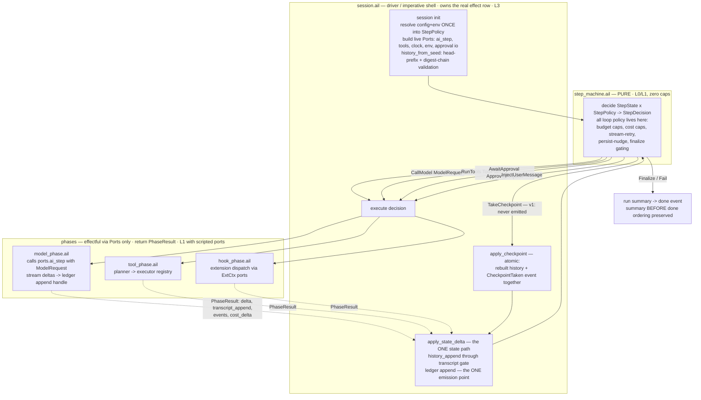
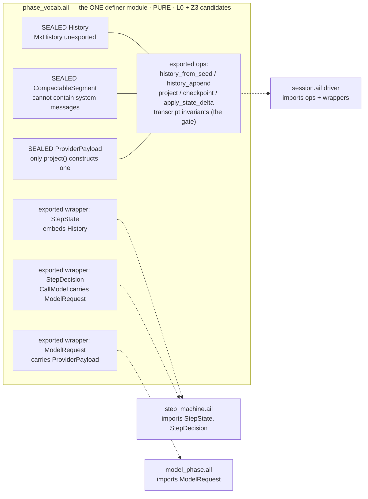
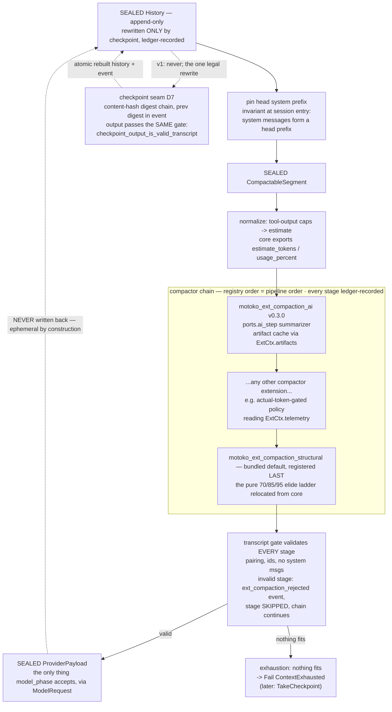
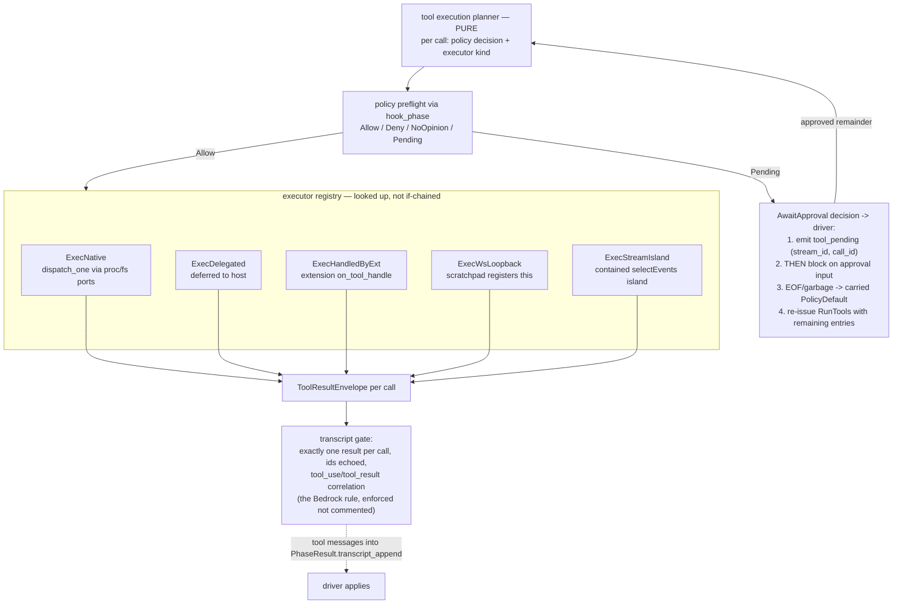
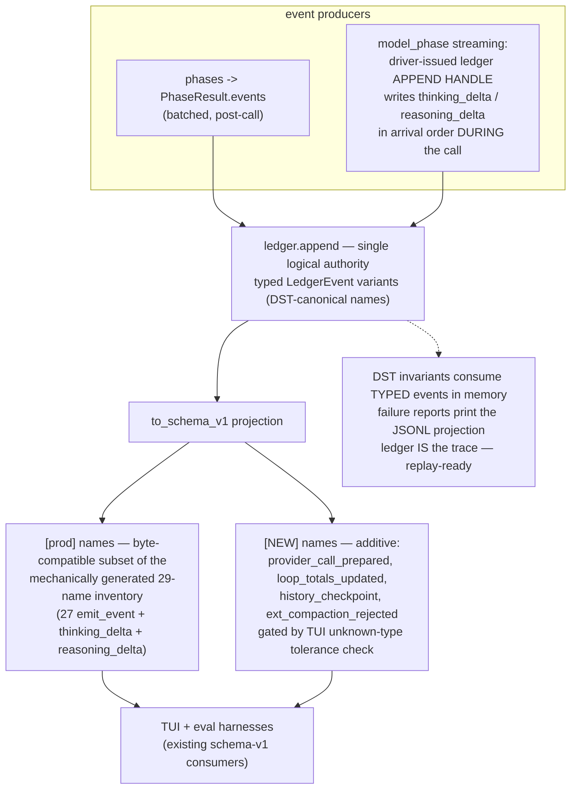
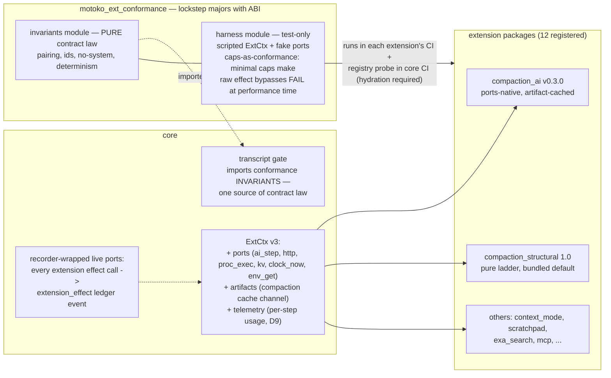

# Diagram: the phase-oriented core (as decided in ADR-001, D1–D9)

Companion to [ADR-001-phase-oriented-core.md](./ADR-001-phase-oriented-core.md) and
[RESEARCH-phase-core-dst-design.md](./RESEARCH-phase-core-dst-design.md). These diagrams show
the **target** architecture (post Phase C + ABI v3), annotated with which migration phase
lands each piece and which DST layer tests it.

Conventions: boxes are modules/functions; **PURE** boxes have no effect row (L0-testable with
zero caps); **SEALED** types are unexported single-constructor variants (constructor
unreachable outside the vocabulary module); dashed edges are data returned as values; solid
edges are calls. `[prod]`/`[NEW]` on events per ADR Decision detail 3.

---

## 1. The main loop — functional core, imperative shell (D1, D5)

The step machine is pure and returns decisions-as-data; the driver owns the only real effect
row, executes decisions through phases, and is the single authority for state application and
ledger emission.

Continuation is state, not a field: `decide` re-derives `RunTools`/`Finalize`/`CallModel` from
typed `StepState` fields (`pending_tool_calls`, `last_finish_reason`, `last_response_text`) —
proven in `sketch/sketch_vocabulary.ail`. Lands: types Phase A, PhaseResult wiring Phase B,
inversion Phase C.

---

## 2. The vocabulary module — sealed types and who may name what (D3, D7; sketch Q1)

Opacity on v0.26.0: unexported variant constructors are sealed (`IMP010`), unexported type
names are unimportable, exported records are forgeable. So the vocabulary module co-locates
every type that NAMES a sealed type; consumers import exported wrappers only.

Proven by `sketch/vocab_probe.ail` + `sketch/probe_consumer_decide.ail`: wrappers cross module
boundaries with **transitive sealing** — a consumer can construct `CallModel(payload)` only
with a payload obtained from `project()`. Bare sealed-type parameters in foreign signatures are
impossible. Lands: Phase A.

---

## 3. Compaction — core scaffold + extension-resident policy chain (D3 amended by D9)

Core owns what polices compactors; ALL policy (ladders, tiers, AI summarization) lives in
extensions, composed as a fold-through chain in registry order.

With zero compactors installed, core behavior is honest exhaustion. Lands: chain conversion +
ladder extraction Phase B; checkpoint types Phase A (never emitted in v1).

---

## 4. Tool phase — executor registry and the approval decision (D4)

No hard-coded extension knowledge in core: the planner assigns each call an executor strategy;
the scratchpad special-case becomes a registered `WsLoopback` executor; approval becomes a
decision the driver performs, preserving the live protocol's ordering.

Lands: Phase B (phases + envelopes), Phase C (AwaitApproval inversion, gated by the scripted
TUI approval scenario).

---

## 5. Events — one ledger, two wire-name classes, streaming handle (D5; review R2/R3-family)

Lands: Phase B (all emission through the ledger; 48 scattered emit sites retired).

---

## 6. Extension boundary — ABI v3 and the conformance kit (D6, D8, D9)

Fault isolation: obligations are composition-closed, so any composition failure decomposes into
"an extension broke its contract" (kit's job) or "core's chain/arbitration is wrong" (core L1
scenario) — and if neither, the contract was too weak and gains an obligation.

---

## Migration overlay

| Piece | Lands |
|---|---|
| Vocabulary module, sealed types, tier-constant exports, transcript builder extraction | **Phase A** (zero behavior change) |
| PhaseResult wiring, ledger + projection, streaming handle, segment fix, compactor chain, structural extension extraction, provider-call seam | **Phase B** |
| Pure `decide`, decision execution, AwaitApproval inversion, L1 scenario families | **Phase C** |
| ExtCtx ports/artifacts/telemetry, conformance kit, compaction_ai 0.3.0, structural 1.0, registry probe | **ABI v3 track** (parallel to B/C; hydration-required gate class) |
