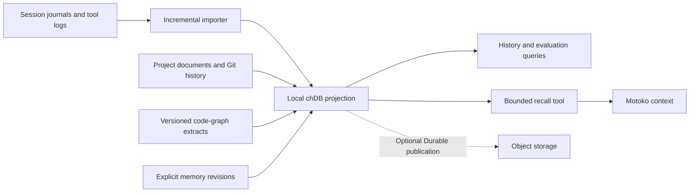

# RESEARCH: chDB for Motoko's cross-run memory and evidence

Date: 2026-10-02
Status: Initial research; hypotheses and proposed experiments, no architecture decision or implementation yet.
Grounded at: Motoko HEAD `4023bf0896a09cd556e5711e9972346f3fe09ce2`, with source inspection of the current working tree.
Starting point: [chDB Durable Layer for agent memory][article], published 2026-09-28.
Evidence level: repository and upstream article/cookbook review. No chDB installation, performance benchmark, retrieval evaluation, or durability test was performed for this document.

## 1. Research question and initial position

Could chDB help Motoko reuse previous work, explain the evidence behind its
decisions, and evaluate whether remembered experience improves subsequent runs?

The strongest initial candidate is an optional analytical layer connecting
session evidence, trajectories, project documents, code structure, and verification
results. Local query capability, useful agent recall, and portable durability are
three separate hypotheses. Each needs its own evidence before adoption.

The initial recommendation is to query existing evidence first, then evaluate
bounded recall, and only then consider object-storage durability. Session recovery
continues to use its existing journal contract. The proposed chDB projection must
be rebuildable from its declared inputs; any curated memory that cannot be rebuilt
needs an explicitly chosen authoritative record.

## 2. Existing Motoko work and implementation

| Foundation | Observed state | Implication |
| --- | --- | --- |
| [Project 002 memory-index research][p002] | Proposes joining `.agent` documents, Git history, and source graphs through chDB, with explicit evidence and freshness. | Project 036 extends that direction with execution history, memory admission, recall evaluation, and durability. |
| [Project 008 documentation discussion][p008] | Discusses document discovery and references existing semantic-retrieval experiments in code-graph tooling. | Inventory those experiments before creating another document index or embedding pipeline. Their results were not revalidated here. |
| [Code-graph tooling][graph-readme] and [query implementation][cgq] | `view_preamble` creates views over generated CSVs; `run_sql` queries them using chDB. Source/effect answers carry freshness and coverage metadata. | There is already a local analytical query surface to extend experimentally. It is not currently a Durable memory database. |
| [Deferred trajectory-memory proposal][trajectory] | Records an earlier implementation with no write call sites and process-local storage. Recommends an optional extension using a persistent process-accessible backend. | A recall-only prototype is insufficient: the producer, restart behavior, and failure reporting must be demonstrated. The historical upstream backend findings need rechecking before implementation. |
| [Host session journal][host-journal] and [core journal][core-journal] | The host owns the append-only session journal; core defines codecs and recovery semantics. | Import journal evidence without creating a competing resume authority or letting the database writer mutate the journal. |
| [Session logger][logger] | A separate consumer handles operational logs and transcript rendering. | Inventory journal and log coverage separately. Neither should be assumed to contain every desired tool or verification field. |
| [MicroRAG extension][microrag] | Uses `std/process` to retrieve information through an external CLI and includes results in tool output. | A process-backed memory tool has a local integration precedent. |
| [Prompt dispatcher][runtime] and [RPC initialization][rpc] | `dispatch_build_system_prompt` has an `IO, Clock` effect signature; prompt atoms operate on `PureCtx`. | Database retrieval cannot simply be added inside a prompt callback. Automatic recall needs an explicit preparation boundary. |
| [ClickStack deployment][clickstack] | Provides an optional server-backed observability path. | Compare its role with local historical queries; avoid duplicating collection without a concrete recall or portability benefit. |

The [viewer dependency declaration][viewer-deps] allows `chdb>=4.2.1`, while its
checked-in lockfile selects 4.2.1. That is evidence of an existing dependency, not
evidence that the environment has the Durable API available.

## 3. What the upstream sources establish

The [article][article] presents local embedded OLAP with object storage holding
recoverable database state. Writes become durable at explicit publication
boundaries; checkpoints reduce subsequent replay work. It describes a
single-writer object model and positions the system for analytical history and
memory rather than transactional shared application state. It reports Python
Durable in chDB 4.4 and availability across other language bindings.

The [cookbook][cookbook] adds operational detail:

- `open()` restores committed state; read-only handles see the manifest at open.
- `execute()` buffers a local mutation; `flush()` publishes it. A tool promising
  durable memory should acknowledge after publication.
- Replay uses SQL statements, requiring materialized IDs, timestamps, and other
  nondeterministic values.
- A group of statements in a flush is not a multi-statement SQL transaction.
- One active database path per process constrains concurrent object access.
- Object IDs are single path segments; hierarchy belongs in the namespace prefix.

The cookbook's older binding-status table and the article differ on Node/Rust
release availability. Pin and verify a binding before a spike. The linked full
Durable documentation could not be fetched during this review; its contract and
implementation remain a follow-up, not evidence already inspected.

The article's local/remote timing comparison does not establish a speedup over
Motoko's local files or SQLite. Its compression example does not establish our
storage footprint. Both require a representative Motoko corpus.

## 4. Candidate capabilities

| Capability | Example question | Evidence needed for a useful answer |
| --- | --- | --- |
| Trajectory recall | How did a previous run resolve this failure? | Task, attempted approach, observed outcome, environment, and source evidence. |
| Code-aware recall | What previous failures involved this function or its dependencies? | Versioned graph snapshot, affected paths/symbols, and relationship provenance. |
| Decision history | Why was this design chosen, and what superseded it? | Document references and explicit revision links, distinguished from inferred overlap. |
| Approach evaluation | Which tool/model strategies repeatedly exhaust budget? | Comparable task groups, costs, outcome labels, and missing-data disclosures. |
| Recall evaluation | Was the supplied memory relevant, current, and useful? | Exact recalled versions, ranking reasons, context cost, and subsequent observations. |

An outcome is not established by an agent claiming completion. Keep separate
fields for declared completion, tool exit results, verification outcomes, and
operator acceptance where available. A test pass supports only its tested scope.
Likewise, retrieval followed by success is correlation; it does not establish
that the retrieved memory caused the success.

## 5. Proposed data model

These are logical research entities, not committed table definitions or a required
copy of an upstream schema.

| Entity | Candidate contents |
| --- | --- |
| `evidence_events` | Project, session/run identity, source kind, source event ID or position, payload hash, observed time, typed event fields, and retained payload/reference. |
| `trajectories` | Task, attempt summary, outcome dimensions, repository revision, relevant environment/configuration, affected paths, and evidence references. |
| `memory_revisions` | Stable memory ID, monotonic revision, claim, scope, admission basis, status, supersession/conflict links, and evidence references. |
| `recall_events` | Query/task identity, selected memory revisions, ranking reasons, retrieval configuration, supplied text hash, and context size. |
| `import_batches` | Source identity and digest, importer/schema version, consumed boundary, completion state, and coverage disclosures. |

Existing document, Git, source, and graph projections should be reused where their
contracts fit. Cross-project recall should be explicit; project identity must not
depend solely on a checkout's absolute path.

### Evidence and memory admission

Importing a transcript makes it searchable evidence. It does not automatically
make every statement reusable advice. An initial admission policy could allow
explicit user rules, explicitly recorded design decisions, and narrowly scoped
lessons supported by verification. Generated summaries remain labeled derivations
with links to their inputs and the summarizer version.

Conflicting memories should remain inspectable. Retrieval needs a defined policy
for active, superseded, disputed, and retracted revisions. Current instructions
and current repository evidence take precedence over historical advice. A raw
tool result must not acquire instruction authority through summarization.

### Identity, freshness, and imports

Use source identities that survive repeated imports. For journal entries this
could include project, session, and journal entry identity, with a payload hash to
detect disagreement. Log and journal records need explicit cross-source matching;
similar timestamps alone do not prove that two records are the same event.

Define duplicate handling before selecting a table engine. An append-only layout
does not itself enforce uniqueness. After a crash between event insertion and
cursor advancement, replaying an import must not double-count evidence in queries.
One candidate is repeatable import batches with logical deduplication; another is
rebuilding a complete projection from retained source files.

Store commit IDs and file hashes for code-linked memories. Dirty worktrees need
content identities beyond HEAD. Function slugs identify a function within a graph
representation; they do not by themselves prove continuity across renames or
revisions. Preserve graph coverage and approximation flags in answers.

## 6. Integration and ownership

### Start with an explicit tool

A candidate extension could expose structured operations such as `MemoryRecall`,
`MemoryRemember`, and `MemoryHistory` through a Python helper. Names and transport
are provisional. Begin with recall as an explicit tool so the retrieved content
enters ordinary tool-result history with its evidence and scope.

Automatic pre-task recall is a later experiment. It needs to prepare retrieval
outside the pure prompt callback, carry the result across an explicit boundary,
and preserve prompt digest and resume semantics. Recomputing different recalled
text during resume must not silently rewrite a sealed system prefix.

Database access should use the extension's supported effect/port boundary. A
helper precedent does not prove that its existing implementation satisfies every
current replay contract. If retrieval affects decisions, recorded execution must
retain the returned content or a resolvable immutable artifact, rather than
re-querying a mutable database during replay.

Use a bounded result contract: project scope, maximum items/bytes, evidence links,
freshness, and a distinction between no match and retrieval failure. Keep the
first agent interface structured while using SQL for operator investigation.

### Choose the writer boundary explicitly

Several sessions may operate in one project at once. The initial candidate is one
project ingestion owner reading independently produced session records. Memory
write requests would also need a queue or serialized helper boundary. This adds
lifecycle responsibility and must be compared with simpler batch ingestion.

Alternatives include per-session stores followed by consolidation, or a shared
server database. Each changes freshness, conflict resolution, and query costs.
Object publication alone would not define how offline divergent memories merge.

Short-lived CLI helpers are easy to integrate but may repeatedly pay startup and
open costs. A long-lived worker amortizes them while requiring shutdown, crash,
lease, and process ownership handling. Measure both before choosing.

### Decide what is authoritative

Initially, journals, logs, and repository artifacts remain source evidence; the
database is a disposable projection. For curated memory, choose between a durable
revision log outside the database and a database-backed authority before promising
persistence. Do not maintain both without a reconciliation contract.

For a future portable store, define local acceptance separately from successful
remote publication. Specify behavior during unavailable storage and interrupted
handoffs. A snapshot of the database also needs a strategy for any referenced
evidence artifacts absent from the destination machine.

## 7. Alternatives and adoption criteria

| Option | Why test it | What would justify moving beyond it |
| --- | --- | --- |
| Existing files plus chDB views | Reuses the code-graph pattern and makes regeneration transparent. | Measured repeated scan, import, or startup cost. |
| SQLite-backed memory | Baseline for a small set of facts and trajectory summaries; already contemplated by the deferred design. | Demonstrated need for broader joins/aggregations or a better measured operating profile. |
| Persistent local chDB | Candidate for accumulated analytical history and repeated joins. | Need to retain prepared state across host replacement. |
| chDB with Durable | Candidate for portable prepared memory under a defined ownership model. | Successful recovery and handoff experiments at acceptable transfer/startup cost. |
| Shared server storage | Candidate when concurrent shared writes dominate. | A workload that justifies its operational and network dependencies. |

These are experiment choices, not benchmark conclusions. SQL capability alone
does not establish that SQLite is unsuitable or that chDB improves recall quality.

## 8. Proposed research sequence

### Experiment A: evidence coverage and query usefulness

Select a bounded corpus with successful, failed, suspended/resumed, and delegated
runs. Inventory what each producer actually records. Include representative
project documents and versioned graph extracts without assuming complete tool
or verification coverage.

Implement three offline questions: prior related tasks, failures associated with
a file/function, and evidence supporting a recorded decision. Compare direct
file queries with a materialized projection. Measure import/startup/query time,
peak memory, disk footprint, and answer completeness. Reimport the corpus and
verify stable logical counts and source links.

Proceed only if the answers are useful and auditable. A polished schema without
answerable questions is not a successful result.

### Experiment B: bounded recall

Create a time-separated evaluation set: retrieval may use only evidence available
before each evaluated task. Compare no recall, simple lexical/metadata recall,
and semantic retrieval only if it adds a distinct hypothesis. Keep model,
configuration, task budget, and memory snapshot fixed within comparisons.

Assess retrieved relevance and stale/contradictory advice separately from task
outcomes. Measure context cost, repeated failed approaches, verification results,
and latency. Use repeated runs where model variability matters. Record negative
results; a retrieval failure must not be reported as an empty corpus.

### Experiment C: storage and lifecycle

After selecting a pinned binding, exercise process death before and after
publication, restart during ingestion, uncertain write acknowledgement, competing
writers, stale readers, and restore into a fresh local directory. Check application
retry identities so an uncertain acknowledgement cannot duplicate a remembered
revision. Verify referenced evidence remains accessible after restoration.

Measure cold restore and checkpoint transfer costs as the corpus grows. A local
development backend can establish an initial harness, but actual object-storage
coordination requires testing the selected backend. These are proposed checks,
not guarantees established by this research.

## 9. Open decisions

1. Is the first user value historical investigation, automatic recall, or portable
   curated memory? The current recommendation is historical investigation first.
2. Which useful fields are absent from current journals/logs, and who should
   produce them without duplicating session semantics?
3. What admits a memory, what can retract it, and how are conflicts surfaced?
4. Which identities span projects, worktrees, hosts, and repository revisions?
5. Should project memory have one writer, independent session writers with
   consolidation, or a shared server owner?
6. What is the authoritative representation of curated memory?
7. What retrieval boundary satisfies the current extension, replay, and resume
   contracts without expanding core effects casually?
8. What retention/deletion behavior applies to both original evidence and its
   derived memories, indexes, and remote copies?
9. What measured improvement would justify maintaining another storage component?

Before drafting an ADR, inventory the existing project-memory experiments, inspect
the pinned Durable contract, and obtain evidence from experiments A and B. A
separate lifecycle spike can then decide whether portability belongs in the first
implementation or remains optional follow-up work.

[article]: https://clickhouse.com/blog/chdb-durable-layer-for-agent-memory
[cookbook]: https://github.com/chdb-io/cookbook/blob/main/durable-agent-memory/README.md
[p002]: ../002_code_graph/RESEARCH-project-memory-index.md
[p008]: ../008_docs_system/NOTE-docs-system-design-discussion.md
[graph-readme]: ../../../tools/code-graph/README.md
[cgq]: ../../../tools/code-graph/query/cgq.py
[trajectory]: ../../../design_docs/planned/m-motoko-trajectory-memory.md
[host-journal]: ../../../src/tui/src/session-journal.ts
[core-journal]: ../../../src/core/journal.ail
[logger]: ../../../src/tui/src/session-logger.ts
[microrag]: ../../../packages/motoko-ext-microrag/register.ail
[runtime]: ../../../src/core/ext/runtime.ail
[rpc]: ../../../src/core/rpc.ail
[clickstack]: ../../../deploy/clickstack/README.md
[viewer-deps]: ../../../tools/code-graph/viewer/pyproject.toml
