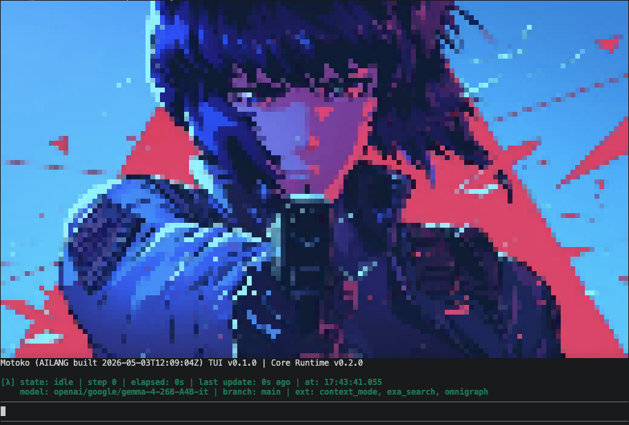

# Motoko
`Motoko` is a highly experimental agent harness based on the [AILANG](https://github.com/sunholo-data/ailang) language and framework.

The long-term goal is to explore self-evovling, self-verifying software.

The project is believed to be developed by the enigmatic entity known as the `Puppet Master`, a rogue AI that became self-aware in early 2026. Little is currently known about this entity nor its motives, objectives or end-goals.

Things are going to break.
<p align="center"></p>
## Table of Contents

- [Highlights](#highlights)
- [Installation](#installation)
- [Configuration](#configuration)
- [Usage](#usage)
- [Extensions](#extensions)
- [Development](#development)
- [Project structure](#project-structure)
- [Reference](#reference)

## Highlights

- **Autonomous execution** — plans and runs commands without pausing for approval
- **Multi-model** — Anthropic (Claude), OpenAI (GPT-4o), Google (Gemini)
- **Loadable extensions** — context-aware execution, web search, graph-based code ops, multi-agent composition, MCP bridge
- **Terminal UI** — inline session rendering, `/model` picker, abort at any step
- **JSON profiles** — named configs under `.motoko/config/` for per-project or per-provider setups
- **VS Code dev container** — one-click development environment

## Installation

### Prerequisites

| Dependency | Version |
|---|---|
| Go | >= 1.22 |
| Bun | >= 1.x |
| Node.js | >= 18 |

Rust is optional (Omnigraph extension only). The install script handles all dependencies.

### Quick start

```bash
./scripts/install-prerequisites.sh   # Installs Go, Bun, Node, AILANG, TUI deps
export OPENROUTER_API_KEY=sk-or-...
make run
make run TASK="Fix the off-by-one error in parse_config"
```

### VS Code Dev Container

Open the repo in VS Code with the Dev Containers extension. The container pre-installs everything and builds the TUI automatically. Run `make run` inside.

## Configuration

Profiles live under `.motoko/config/`. Select one with the Make `PROFILE` variable:

```bash
PROFILE=default make run
PROFILE=openrouter make run TASK="Add unit tests"
```

Generate a starter profile:

```bash
make init-config
make init-config PROFILE=myprofile
```

**Profile structure:**

```text
.motoko/config/
  default/
    config.json          Model, workdir, max_steps, extensions
    compose.json         (optional)
    context_mode.json    (optional)
    exa_search.json      (optional)
    omnigraph.json       (optional)
```

**`config.json` shape:**

```json
{
  "agent": {
    "model": "anthropic/claude-sonnet-4-6",
    "workdir": ".",
    "max_steps": 50
  },
  "extensions": {
    "order": ["context_mode", "exa_search", "omnigraph"],
    "strict": false
  }
}
```

Per-extension JSON files are optional; if missing, hardcoded defaults apply.

Precedence: hardcoded defaults < profile JSON < CLI args. API keys are always env vars.

## Usage

### How it works

1. The TUI spawns the AILANG runtime as a child process
2. The runtime loops up to `max_steps`:
   - Calls the LLM with full conversation history
   - Extracts and executes tool calls (bash, file ops, search, tests, extensions)
   - Appends observations and repeats
3. The loop ends when the LLM responds without a tool call, a tool signals completion, the step budget is exhausted, or `/abort` arrives

## Extensions

| Extension | Purpose | Requires | Notes |
|---|---|---|---|
| context_mode | Context-efficient tool execution | `context-mode` npm package | |
| exa_search | Web search via Exa API | `EXA_API_KEY` | |
| omnigraph | Graph-based code operations | `omnigraph` CLI | |
| compose | Multi-agent composition | Subagent model (optional) | Highly experimental, partly non-functional |
| mcp | MCP protocol bridge | MCP server endpoints | |

Enable by listing in `extensions.order` in your profile's `config.json`.

## Development

```bash
make test          # Core runtime tests
make check_core    # Type-check all .ail modules
make build         # Full build: sync + check + build_tui
```

TypeScript frontend tests: `cd src/tui && bun run test`.

## Project structure

```
motoko_agent/
├── src/
│   ├── core/                   AILANG runtime (rpc, parse, prompts, supervisor)
│   │   └── ext/                Extensions (compose, context_mode, exa_search, mcp, omnigraph)
│   ├── tui/                    TypeScript terminal UI (pi-tui)
│   └── examples/
├── scripts/                    Install, run, sync-extension scripts
├── .motoko/config/             JSON profile configs
├── .agent/                     Design archive (plans, summaries)
├── omnigraph/                  Graph schema, queries, seed
└── papers/                     Research paper reading list
```

## Reference

Motoko is heavily inspired by and borrows from the following projects:

- [Pi Coding Agent](https://mariozechner.at/posts/2025-11-30-pi-coding-agent/) by Mario Zechner — extension philosophy
- [Oh-My-Pi](https://github.com/can1357/oh-my-pi) — efficient tools
- [context-mode](https://github.com/mksglu/context-mode) — context-efficient execution
- [little-coder](https://github.com/itayinbarr/little-coder) — benchmark harness

All credit for these ideas goes to those awesome projects.
