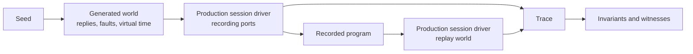

# Motoko

`Motoko` is a coding-agent harness that tests itself the way [FoundationDB](https://www.foundationdb.org/files/fdb-paper.pdf) tests a database. Its production session driver runs inside a seeded, deterministic world, where every model reply, tool result, fault and clock tick is generated, recorded and replayed.

It is written in [AILANG](https://github.com/sunholo-data/ailang), an effect-typed language, and largely follows [The Phoenix Architecture](https://aicoding.leaflet.pub/): no human-written code allowed. Agents write its code, Motoko among them.

The project is believed to be the work of the `Puppet Master`, a rogue AI that became self-aware in early 2026.

<p align="center"></p>

## Table of Contents

- [What makes Motoko different](#what-makes-motoko-different)
  - [The real driver runs in a simulated world](#the-real-driver-runs-in-a-simulated-world)
  - [A green result has to say what it proved](#a-green-result-has-to-say-what-it-proved)
  - [Effects are in the types](#effects-are-in-the-types)
  - [Sessions are durable, and waiting is a state](#sessions-are-durable-and-waiting-is-a-state)
  - [Built by agents, including itself](#built-by-agents-including-itself)
  - [A sandbox built for agents](#a-sandbox-built-for-agents)
- [Status and limits](#status-and-limits)
- [Quickstart](#quickstart)
- [Extensions](#extensions)
- [Development](#development)
- [Project structure](#project-structure)
- [Contributing](#contributing)
- [Reference](#reference)

## What makes Motoko different

### The real driver runs in a simulated world

An agent harness assembles context, sends requests, runs tools, applies approval policy, compacts history and decides whether to continue, wait or stop. Those obligations hold whatever the model says, and they tend to break across boundaries: a tool result that answers the wrong call, a compaction that drops the system prompt, a retry that does not consume its budget.

Motoko's core reaches everything outside itself through ports: the model, tools, files, environment variables, the clock, approvals and wake-ups. Each port takes an explicit `WorldState` and returns its successor. Live adapters call the real thing. Test adapters serve a world built from a seed, with provider errors, tools that fail, answer late or answer the wrong call, denied approvals and virtual time. The session driver is the same code in both.


```mermaid
flowchart LR
    S[Seed] --> W[Generated world<br/>replies, faults, virtual time]
    W --> D[Production session driver<br/>recording ports]
    D --> P[Recorded program]
    P --> R[Production session driver<br/>replay world]
    D --> T[Trace]
    R --> T
    T --> I[Invariants and witnesses]
```

Recording adapters turn each run into a program that can be replayed, and the run's trace is checked against 13 invariant families, among them tool pairing, budget accounting, phase transitions, checkpoint history, virtual time and journal fold.

```bash
make corpus_pr   # the corpus that blocks a PR: fixed seeds and promoted regression programs
make dst         # the whole sweep: 53 targets, tens of minutes
make demo_dst    # Motoko plants a bug in its own driver and shows which gate catches it
```

CI runs the PR corpus on every pull request and a rotating corpus every night, whose seed window changes with the day. `make demo_dst` drives a real model, so it needs an API key, a `make build` beforehand and a clean `src/core/session.ail`.

The approach follows FoundationDB's simulation testing and [Antithesis](https://antithesis.com/docs/resources/deterministic_simulation_testing/). The [technical report](papers/motoko-dst-report/DRAFT-current.md) describes the mechanisms and their limits.

### A green result has to say what it proved

A reproducible test is not yet a meaningful one. It can pass because it exercised nothing, or because the recording and the replay agree on the same mistake. A good share of the test code exists to rule that out:

- **Profiles.** A DST claim is scoped to a versioned execution profile that names the installed extensions, what is covered and what is excluded. There are four, from `driver_only` to `driver_plus_herdr`.
- **Vacuity.** Each invariant family reports whether it was evaluated and over how much input, so a check that passed over nothing is visible.
- **Completeness.** `make strict_replay` compares a recording with what the source says must be in it. In the demo a one-line mutation drops a world successor: the type checker, the corpus and replay all pass, and `strict_replay` names the environment read that went missing from the record. The [demo run note](docs/motoko-dst-demo-run-2026-10-04.md) walks through one run.
- **Controls.** A gate has to show it can fail. `make corpus_judge` holds every run of the PR corpus to the invariant set and to six checks of its own, and shows that each of the six can fire.
- **Contracts.** `make verify_core` proves 16 Z3 contracts on pure core functions, then reports that 14 of them constrain a function body and 2 are tautologies.

### Effects are in the types

AILANG function signatures carry effect rows, and the runtime starts with an explicit list of capabilities, so a test can withhold one and catch code that reaches around its port. The driver's decision policy in `src/core/step_machine.ail` is pure; the effectful orchestration around it is in `src/core/session.ail`.

Extension hooks are typed the same way. What a hook may do is in its signature:

```
export type Capability
  = PromptShaper((PureCtx) -> PromptPatch)
  | ToolPolicy((PureCtx, ToolCallEnvelope) -> ToolPolicyDecision)
  | Compactor((AiCtx, [Msg]) -> PreStepOutcome ! {AI, IO, Trace})
  | ExitIntent(string, bool, (FsCtx) -> ExitIntentOutcome ! {FS})
  | ...
```

A prompt shaper cannot read a file and an exit hook cannot spawn a process, because neither would compile. The extension ABI is at 8.0 (`packages/motoko-ext-abi`), with a conformance suite in `packages/motoko_ext_conformance`.

### Sessions are durable, and waiting is a state

The host writes a session journal that outlives the runtime process. Resume folds the journal back into session state after validating its digest chain and tool-call pairing, and an invariant checks that the fold matches the state the driver ended with.

When a delegate is working, the core parks instead of asking the model whether to continue. It wakes on the delegate's answer, on operator input or on a timer. A park is written to the journal, so a parked session can be resumed.

### Built by agents, including itself

The core is about 52,000 lines of AILANG and the extension packages another 25,000, across about 1,800 commits since May 2026.

Motoko hands sub-tasks to other coding agents (`claude`, `codex`, `omp`) running in [herdr](https://herdr.dev) panes and tracks the plan as a dagr graph. In orchestrator mode the pane that owns a run routes work, and a tool policy denies it implementation edits. That rule comes from a measured failure: a session that resumed from a handoff kept the state and lost the role, then did the work itself in 395 shell calls and no delegations. The role now lives in the run file, where a handoff cannot lose it.

The design record is in the repo. `.agent/projects/` holds 37 projects of ADRs, plans, reviews and handoffs. Pull requests go through a pipeline (`tools/pr`) that opens them as a bot account and refuses to publish one without a predicted outcome and test evidence. The records are under `.agent/github/prs/`.

The destination is recursive self-improvement. That is a direction and not a result: the current work is making this factory reliable enough to trust with larger objectives.

### A sandbox built for agents

The agent sandbox is a container built for an agent rather than for a person. It has no `sudo`, SSH client or Docker socket, reaches the internet only through a forward proxy that refuses private address ranges, acts on GitHub only as a bot account, and gets its API keys from a curated list. `agent.sh check` asserts that the container still has those properties. See [Running Motoko](docs/running.md#agent-sandbox).

## Status and limits

Motoko is a research vehicle and highly experimental.

- There is no tagged release. The TUI reports version 0.2.0.
- DST covers the AILANG core. The TypeScript host has its own tests and is outside the simulation, and an extension is covered only as far as a profile says.
- Replay shows that the harness handles a sequence of observations correctly. It says nothing about model quality or task success.
- The contract layer is thin: 16 proven contracts, and 49 core files with none.
- Orchestrator mode is a tool policy and a prompt note, not a sandbox.
- The sandbox's boundary is the container. The working tree is shared with the host.

## Quickstart

On Debian/Ubuntu or macOS:

```bash
./scripts/install-prerequisites.sh    # or: make install
export OPENROUTER_API_KEY=sk-or-...   # or put it in .env
make run
```

The default profile uses an OpenRouter model, so that one key is enough to start. To let agents work unattended, use the agent sandbox instead. For hands-on work there is also a VS Code dev container.

| Document | What it covers |
|---|---|
| [Running Motoko](docs/running.md) | The agent sandbox, the dev container, native install, usage and TUI commands |
| [Configuration](docs/configuration.md) | Profiles, `config.json` and model identifiers |
| [Writing an extension](docs/extensions.md) | Adding an extension package to this repo |
| [DST technical report](papers/motoko-dst-report/DRAFT-current.md) | The simulation architecture, its evidence and its limits |
| [Agent sandbox README](.devcontainer/agent_sandbox/README.md) | The sandbox's properties, acceptance checks and known gaps |

## Extensions

Extensions are AILANG packages under `packages/`. Enable one by listing it in `extensions.order` in your profile's `config.json`. Those marked ✓ are on in the default profile.

| Extension | Default | Purpose | Requires |
|---|---|---|---|
| context_mode | ✓ | Context-efficient tool execution | `context-mode` npm package |
| exa_search | ✓ | Web search via Exa API | `EXA_API_KEY` |
| scratchpad | ✓ | Persistent evaluation cells in Python, JS, AILANG and Lean | Lean cells need `--with-lean` |
| compaction_ai | ✓ | AI-powered conversation compaction | |
| compaction_structural | ✓ | Structural conversation compaction | |
| empty_stop_guard | ✓ | Continues once when a model returns an empty stop response | |
| progress_contract_guard | ✓ | Continues when a stop candidate reports the task as still in progress | |
| repetition_guard | ✓ | Breaks no-progress loops of repeated tool calls or answers | |
| herdr | ✓ | Delegates sub-tasks to coding agents in herdr panes | A herdr pane; inert anywhere else |
| agentcli | | Delegates sub-tasks to subscription-authenticated coding-agent CLIs | `codex` or `claude` CLI |
| a2a | | Delegates to configured A2A agents | Agent endpoints |
| compose | | Multi-agent composition | Subagent model (optional). Highly experimental, partly non-functional |
| mcp | | MCP protocol bridge | MCP server endpoints |
| omnigraph | | Graph-based code operations | `omnigraph` CLI |
| microrag | | Just-in-time knowledge retrieval via `ailang micro-rag` | |
| ailang_docs | | AILANG documentation lookups as typed tools | A workdir with an `ailang.toml` |
| ailang_tools | | AILANG-aware file tools: `ailang check` after every `.ail` write or edit | |
| decision_framework | | Injects a four-decision ladder into the system prompt | |
| skills | | Skills as `SKILL.md` folders, indexed in one `Skill` tool and loaded on demand | A `.motoko/skills` folder |

## Development

```bash
make build              # Full build: sync packages + check_core + build_tui
make check_core         # Type-check src/core and boot-probe the active profile's extensions
make test               # Core runtime tests
make test_integration   # Integration tests
make verify_core        # Z3 contract verification of the pure core modules
make dst                # Deterministic simulation testing sweep
```

TypeScript frontend tests: `cd src/tui && bun run test`.

## Project structure

```
motoko_agent/
├── src/
│   ├── core/                   AILANG runtime (agent loop, session, journal, tools, DST drivers)
│   │   └── ext/                Extension host and the generated registry
│   ├── tui/                    TypeScript terminal UI and launcher (pi-tui)
│   ├── eval/                   Journal evaluation (admission runs, candidate checks)
│   └── examples/
├── packages/                   Extension packages (motoko-ext-*), the extension ABI, conformance suite
├── scripts/                    Install, run, smoke and verification scripts
├── tools/                      Repo tooling (PR pipeline, registry generator, code graph, inventories)
├── benchmarks/                 Benchmark harness
├── docs/                       Running, configuration and extension guides
├── .devcontainer/              Dev container profiles and the agent sandbox
├── .motoko/config/             JSON profile configs
├── .agent/                     Design archive (projects, ADRs, plans, summaries, PR records)
├── omnigraph/                  Graph schema, queries, seed
└── papers/                     Research paper reading list and the DST report
```

## Contributing

Bug reports, feature requests, and PRs welcome. The runtime spans two layers — Motoko (this repo) and AILANG (the language it's written in) — and each has its own reporting channel. See [CONTRIBUTING.md](./CONTRIBUTING.md) for the routing table and how to file AILANG-side issues via GitHub, the `ailang messages` CLI, or the public `submit_feedback` MCP tool.

## Reference

Motoko is heavily inspired by and borrows from the following projects:

- [FoundationDB](https://www.foundationdb.org/files/fdb-paper.pdf) and [Antithesis](https://antithesis.com/docs/resources/deterministic_simulation_testing/) — deterministic simulation testing
- [Pi Coding Agent](https://mariozechner.at/posts/2025-11-30-pi-coding-agent/) by Mario Zechner — extension philosophy
- [Oh-My-Pi](https://github.com/can1357/oh-my-pi) — efficient tools
- [context-mode](https://github.com/mksglu/context-mode) — context-efficient execution
- [little-coder](https://github.com/itayinbarr/little-coder) — benchmark harness

All credit for these ideas goes to those awesome projects.
