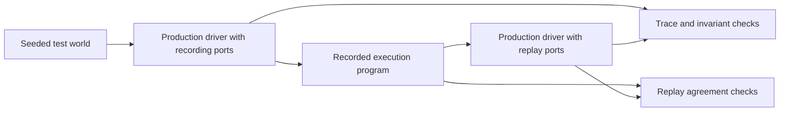

# Motoko

**Deterministic simulation and verification of an AI-generated agent runtime.**

Motoko is an experimental coding-agent harness implemented in [AILANG](https://github.com/sunholo-data/ailang). It combines deterministic simulation testing, execution replay, trace invariants, fault injection and SMT-based verification. The production session driver is executed against controlled environmental observations, allowing failures in state management and control flow to be reproduced and examined.

Motoko's own runtime is the principal system under test. Development follows an agent-written-code model, with contributions from Motoko itself and other coding agents. The repository therefore provides a concrete setting for studying the verification of AI-generated software, including the adequacy of its tests and the sensitivity of its test oracles: the mechanisms that determine whether an execution is correct.

The intended audience includes agent-system developers, software-testing practitioners and researchers working on program verification, reproducibility and AI-assisted software engineering.

## Contents

- [Research scope](#research-scope)
- [System and simulation boundary](#system-and-simulation-boundary)
- [Testing methodology](#testing-methodology)
- [Documented mutation experiment](#documented-mutation-experiment)
- [Reproducing and extending the tests](#reproducing-and-extending-the-tests)
- [Evidence and limitations](#evidence-and-limitations)
- [Running the agent](#running-the-agent)
- [Repository and contributions](#repository-and-contributions)
- [Background and related work](#background-and-related-work)

## Research scope

The testing framework examines the behavior of an agent harness under specified sequences of model responses, tool outcomes, approval decisions and timing events. Properties of interest include tool-call correlation, bounded execution, preservation of required context, consistent state transitions and session reconstruction.

The main questions are:

1. **Reproducibility:** Can an execution be repeated with the same environmental observations and produce consistent interactions, traces and outcomes?
2. **Fault handling:** Does the production driver preserve its invariants when modeled providers, tools or approvals fail?
3. **Oracle sensitivity:** Do the checks reject deliberately invalid executions and selected implementation mutations?
4. **Evidence adequacy:** Did a passing check receive relevant input, execute on the intended path and cover the capabilities attributed to it?

These questions concern the runtime's handling of observations. Evaluation of model reasoning, tool selection and task completion requires additional experiments with live workloads. Applying the methodology to another codebase requires defining its environmental boundary and correctness properties.

## System and simulation boundary

The runtime separates a [pure decision policy](src/core/step_machine.ail) from the [session driver](src/core/session.ail) that coordinates effects. The driver accesses model calls, tools, filesystem operations, environment variables, approvals, time and wake observations through [ports](src/core/ports.ail). Each port receives an explicit `WorldState` and returns a result with a successor state.

Live adapters perform external operations. Simulation adapters supply controlled responses, fault outcomes and virtual time. Both configurations execute the production driver. This arrangement makes environmental behavior reproducible while retaining the implementation whose state transitions are being tested.



AILANG effect types constrain the operations available to a function or extension hook. Runtime capability restrictions provide an additional test mechanism: a simulation can withhold an effect capability and detect attempts to access that class of ambient operation. Granted capabilities and ambient extension-registration effects remain part of each profile's disclosed boundary.

The TypeScript host manages the UI, process lifetime, external wake observations and durable journal writing. Core simulations model inputs at these interfaces. Host behavior and selected cross-process interactions have separate tests.

## Testing methodology

### Generated execution and replay

Seeded generators provide responses to requests made by the driver, including modeled provider errors, tool failures, correlation mismatches, approval denials and deadline events. Recording adapters produce an execution program containing the encountered interactions and an execution manifest. Replay reconstructs the modeled environment from that program and checks the resulting execution.

Reproduction depends on the source revision, toolchain, profile, initial state and configuration as well as the seed or recorded program. A seed alone is insufficient when generator behavior or configuration changes.

The [CI corpus workflow](.github/workflows/dst-corpora.yml) combines a fixed PR corpus, including promoted regression programs, with a scheduled corpus whose seed window changes daily. The broader `make dst` sweep contains additional checks; its scope differs from the CI target set.

### Invariants and coverage accounting

The [common evaluator](src/core/dst_invariants.ail) defines invariant families over execution traces and outcomes. Examples include:

| Property | Obligation under examination |
|---|---|
| Tool pairing | Results correlate with the calls that produced them. |
| Budget accounting and bounded progress | Execution respects the applicable limits and progress rules. |
| Phase transitions | The driver follows permitted runtime transitions. |
| Checkpoint history | Required history survives the tested checkpoint operations. |
| World transitions and virtual time | State successors and modeled time remain consistent. |
| Journal fold | Reconstructing journaled state agrees with the driver's recorded result. |

Each family records whether it was evaluated and the size of its input. This exposes vacuous results, such as a pairing check that passes because it received no tool calls. Interpretation also depends on the runner's call sites and reached branches.

[Versioned execution profiles](src/core/dst_profile.ail) identify installed extensions, capability coverage, exclusions and fault waivers. The presence of an invariant or profile definition is distinct from evidence that a particular run exercised it.

### Test-oracle validation

Replay agreement is one consistency relation. Recording and replay can share a defect, so the testing framework also uses trace witnesses, adapter state, request ordinals, selected observations collected across process boundaries and source-derived completeness expectations. Their independence and scope must be assessed for each check.

The [`corpus_judge` gate](scripts/dst/corpus_judge_dst.ail) applies the common invariants and additional checks to the PR corpus's driver runs. It compares provider and tool activity across observation channels, checks budget and ordinal constraints, and uses constructed negative controls to establish that its additional checks can fail. These obligations are scoped to its `driver_only` configuration and documented control runs.

Targeted mutation checks complement these controls by modifying production code and testing whether the relevant checker rejects the change. A rejected mutation establishes sensitivity to that defect under the tested configuration. Broader detection-rate claims require a defined mutation population and coverage of the paths containing those mutations.

### Formal contracts

For supported pure functions, AILANG uses Z3 to verify postconditions under declared preconditions. Contract verification is accompanied by a [classification procedure](tools/verify_classify/classify.py) that distinguishes:

| Classification | Interpretation |
|---|---|
| `substantive` | The contract excludes some possible results while allowing results beyond the implementation's exact answer. |
| `tautology` | The contract holds for every result allowed by the preconditions. |
| `spec-equals-body` | The contract admits only the implementation's answer. |
| `unclassified` | The classification probes could not be decided within the supported verifier fragment. |

Classification preserves the original preconditions. It helps identify uninformative specifications, although a substantive contract still requires review for relevance to the function's intended behavior. [Selected contract mutations](scripts/verify_contract_mutations.sh) remove conditions from guard predicates and require the verifier to produce a violation with an expected counterexample.

## Documented mutation experiment

A [run recorded on 2026-10-04](docs/motoko-dst-demo-run-2026-10-04.md) introduced a one-line mutation in `session_policy_init`. The mutation reused an earlier world state, discarding the recorded `MOTOKO_RETRY_STREAM_ERROR` environment read while retaining the value obtained from that read.

| Observation | Restored implementation | Mutated implementation |
|---|---|---|
| Type check | Passed | Passed |
| Four-seed rotating corpus | Passed | Passed |
| Agreement between recording and replay | Passed | Passed |
| Recorded interactions in the rich scenario | 31 | 30 |
| Recording completeness assertion | Passed | Detected the missing read |
| `make strict_replay` | Passed | Failed |

The completeness assertion compares the recording with an expected read count derived from source and scenario control flow. That expectation is separate from the recorder; it is not an independent runtime instrument counting every read. The experiment demonstrates a specific failure of replay agreement to establish recording completeness, and the detection of that failure by an additional oracle.

These are observations from the linked run, whose working tree contained unrelated changes. They are not results from a fresh validation of the current revision. The run note and [retained tool output](docs/evidence/demo-dst-2026-10-04.txt) document the conditions and diagnostics.

## Reproducing and extending the tests

From a checkout on Debian, Ubuntu or macOS, install the pinned toolchain and resolve local packages:

```bash
./scripts/install-prerequisites.sh
make sync_packages
```

The principal entry points are:

```bash
make corpus_pr              # Fixed corpus and promoted regression programs
make corpus_judge           # Invariants, additional corpus checks and controls
make strict_replay          # Replay, witnesses and recording completeness
make verify_core            # Verify contracts on supported pure core functions
make verify_classify_check  # Recompute and validate contract classifications
make dst_target_list        # Inspect the full sweep's target list
make dst                    # Run the full sweep
```

The corpus and strict-replay tests use simulated provider responses. Conventional tests are available through `make test`, `make test_integration` and, for the TypeScript host, `cd src/tui && bun run test`.

`make verify_mutations` runs the selected contract mutation checks. It edits and restores source files in place, so use a dedicated checkout without concurrent builds or tests. To reproduce the agent-conducted demonstration, run `make build` followed by `make demo_dst`. That demonstration requires a live provider key, a clean `src/core/session.ail` and exclusive use of its source and temporary paths.

For an experimental result, report the commit and local modifications, toolchain versions, execution profile and version, seed window or program identity, initial inputs, commands, exit statuses, invariant evidence and exclusions. Retain the complete failure record alongside the replay artifacts. Mutation studies should additionally identify the operators, eligible locations, exercised paths and surviving mutations.

## Evidence and limitations

The repository contains executable tests, versioned declarations and dated observations. Current conformance must be established by running the relevant gates on the revision under study. The [technical report](papers/motoko-dst-report/DRAFT-current.md) and its [scope notes](papers/motoko-dst-report/SCOPE-current.md) describe their source snapshot and collected evidence.

- **Simulation coverage:** The core's modeled environment excludes parts of the host, operating system and external services. Extension coverage is specific to the selected profile.
- **Specification coverage:** Invariants address declared structural properties. SMT verification covers a limited subset of pure functions and depends on the adequacy of their contracts.
- **Oracle sensitivity:** Targeted controls and mutations provide local evidence. This README reports no aggregate mutation score or comparative defect-detection rate.
- **Session recovery:** Journal reconstruction and park/resume tests cover specific lifecycle obligations. They do not establish exhaustive crash-point coverage or filesystem durability.
- **External validity:** Modeled trajectories do not establish the frequency of faults in production, model quality or successful completion of real tasks.

Further empirical work includes measuring mutation sensitivity across invariant families, examining the independence of observation channels, extending fault coverage and comparing regression behavior across code revisions. Recursive self-improvement remains a research objective; the methods described here supply bounded evidence about changes to the runtime.

## Running the agent

After installing the toolchain:

```bash
export OPENROUTER_API_KEY=sk-or-...
make run
```

Motoko provides a terminal UI, file and shell tools, configurable model providers, conversation compaction and delegation to other coding agents. Extensions add retrieval, MCP integration, scratchpad evaluation and additional tool policies. Configuration profiles select the model and extension set.

See [Running Motoko](docs/running.md), [Configuration](docs/configuration.md) and [Writing an extension](docs/extensions.md). The [agent sandbox](.devcontainer/agent_sandbox/README.md) provides a container environment for unattended operation; its working tree is shared with the host.

## Repository and contributions

| Location | Contents |
|---|---|
| [src/core/](src/core/) | Production runtime, simulation models, invariants and journal reconstruction |
| [scripts/dst/](scripts/dst/) | Simulation runners, corpus gates and controls |
| [tools/verify_classify/](tools/verify_classify/) | Contract classification and policy checks |
| [src/tui/](src/tui/) | TypeScript host, terminal UI and host tests |
| [src/eval/](src/eval/) | Journal-derived evaluation machinery |
| [packages/](packages/) | Extension packages, typed interface and conformance suite |
| [.agent/projects/](.agent/projects/) | Design decisions, experimental records, reviews and plans |

Contributions concerning test adequacy, reproducible failures, contract quality and empirical evaluation are welcome. [CONTRIBUTING.md](CONTRIBUTING.md) describes the development workflow and issue routing. Reports should identify the violated property, provide a reproduction and state the scope of the evidence.

## Background and related work

The simulation approach is informed by the testing architecture described in [Zhou et al., *FoundationDB: A Distributed Unbundled Transactional Key Value Store*, SIGMOD 2021](https://www.foundationdb.org/files/fdb-paper.pdf), and [Antithesis's account of deterministic simulation testing](https://antithesis.com/docs/resources/deterministic_simulation_testing/). Motoko applies these principles to an agent runtime with explicit environmental ports.

The implementation uses [AILANG](https://github.com/sunholo-data/ailang). Its agent-written development model follows [The Phoenix Architecture](https://aicoding.leaflet.pub/). Other influences include [Pi Coding Agent](https://mariozechner.at/posts/2025-11-30-pi-coding-agent/), [Oh-My-Pi](https://github.com/can1357/oh-my-pi), [context-mode](https://github.com/mksglu/context-mode) and [little-coder](https://github.com/itayinbarr/little-coder).
