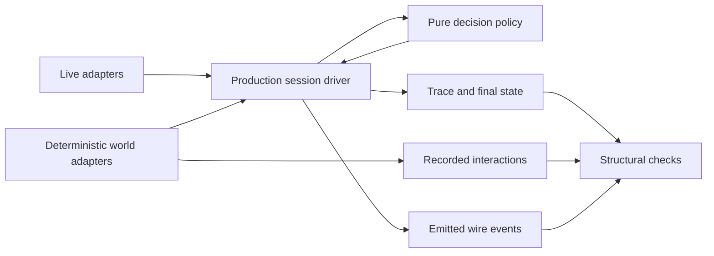
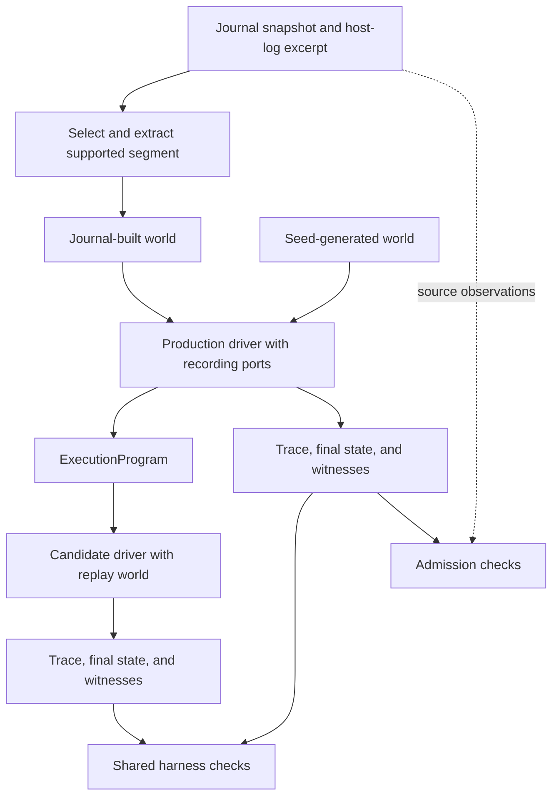

# Deterministic Simulation Testing for an LLM Agent Harness

*Architecture, replay, and evidence in Motoko*

Third integrated draft · 2026-09-19. Implementation snapshot:
`7e5ec5f9`. The implementation and validation status is summarized in §8.4;
source notes appear in Appendix A.

## Abstract

An LLM agent harness must preserve tool-call pairing, budgets, conversation
history, and lifecycle state while interacting with an unpredictable environment.
Motoko tests these responsibilities by running its production session driver
against an explicit deterministic world. Generated worlds explore modeled
responses, faults, and timing; recording adapters produce execution programs that
can be replayed and checked through structural invariants. The current architecture
extends this approach with witnessed world-state transitions, explicit park/wake
behavior, and a durable session journal whose reconstruction is checked against
the driver's final state. Journal-derived evaluation connects recorded workloads
to the same recording, replay, and invariant machinery through an admission run.
Alongside the architecture, we describe an evidence discipline: simulation claims
are scoped to versioned execution profiles, and coverage distinguishes declared
properties, observed effects, substantive exercise, and vacuous success. The
report explains the mechanisms and their limits; it does not claim universal
hermeticity, complete live-execution fidelity, or a measured bug-detection rate.

## 1. Why test the harness deterministically?

An agent harness is the software around a model. It assembles context, sends
requests, executes requested tools, applies approval policy, compacts history,
coordinates extensions, and decides whether to continue, wait, or stop. The model
chooses actions within that machinery, but the machinery has obligations that
should hold across model choices. A tool result must answer the right call. A
checkpoint must preserve the required system instructions. A retry must consume
its budget. A resumed session must recover the state its next decision needs.

These obligations often fail across boundaries. Provider telemetry from one step
can affect the next step's context calculation. A compaction can change the
payload sent to the provider while leaving the retained history inconsistent.
An extension can receive the wrong context. A configuration read can silently
disable behavior the test intended to exercise. Individually correct helpers do
not establish that their callers preserve the relationships among these values.

Unit tests are useful for individual policies and transformations. Live task
evaluations are useful for measuring the combined behavior of model and harness.
Neither, alone, supplies controlled replay of every interaction in a failing
session. Deterministic execution supplies that additional instrument: hold the
environmental observations fixed, run the production harness, and ask whether its
state transitions satisfy the required properties.

Consider a simple illustrative session. The model requests a file-reading tool
with call identifier `c1`. The tool returns a body associated with `c1`. The driver
appends the result and prepares the next provider request. The answer's wording
is incidental to several useful properties: the result must follow its call,
appear exactly once, preserve the system prefix, and reach the next request. A
failed or denied tool call must also leave a structurally valid conversation.
We use this sequence throughout the report to connect the mechanisms.

Motoko's design has two closely related contributions. First, it makes an
agent's environment explicit enough to run the real session driver inside a
controlled world, record its interactions, and replay them. Generated and
journal-derived workloads use this common machinery. Second, it treats the
meaning of a passing test as an engineering responsibility. Profiles state what
was installed and covered; witnesses check recording completeness; inventories
check that obligations did not silently disappear; and vacuity accounting
distinguishes a property exercised by the run from one satisfied over no cases.

This second contribution governs the first. Reproducibility makes a failure
repeatable. It does not establish that the test exercised useful behavior or that
its checker could detect a relevant defect. A reliable testing account needs all
three: controlled execution, suitable observations, and justified assertions.

## 2. Background and system context

### 2.1 Deterministic simulation and neighboring methods

Deterministic simulation testing places implementation code in a controlled
environment whose choices can be repeated. FoundationDB's simulation framework
executes interacting processes within one physical process and models failures
and recovery at network, disk, process, and request boundaries. Its experience
motivates testing the interactions that ordinary feature tests may rarely
encounter. [FoundationDB, SIGMOD 2021][fdb].

TigerBeetle's VOPR similarly runs a cluster inside a simulator, using generated
workloads, injected faults, and controlled time to exercise its implementation.
Antithesis places the determinism boundary at a hypervisor, permitting otherwise
nondeterministic software to run inside a controlled environment. These are
different ways to obtain reproducible execution; the location of the boundary
determines what must be modeled and what remains part of the system under test.
[TigerBeetle architecture][tiger]; [Antithesis DST overview][antithesis].

Several testing methods can use the same deterministic substrate. A fixed
scenario chooses a particular sequence. Parameter generation varies inputs such
as history length or a policy threshold. Reactive world generation chooses
responses and timing as the production code issues requests. Replay consumes
previously recorded interactions. These methods answer different questions and
can share adapters, observations, and invariants.

Motoko uses a deliberately narrower naming rule for its generated simulation
axis. A seed that changes input sizes is insufficient by itself: the generated
world must also control environmental trajectories, logical faults, and time,
with reproducibility and structural checks. That is a project conformance rule,
not a claim that property-based testing in general cannot model state or effects.
Fixed and parameter-generated regression scenarios remain valuable even when
they do not meet this stronger bar. [Taxonomy decision][taxonomy].

### 2.2 The Motoko loop and its host

The production core is written in AILANG. A pure decision function examines
`StepState` and selects the next action: call the model, run tools, request
approval, take a checkpoint, inject a control message, park, or finish. The
session driver executes those decisions, dispatches extension capabilities, and
threads the resulting state. Considerable orchestration remains effectful;
the whole driver is not a pure function returning commands. [Decision policy][step];
[session driver][session].

Extensions participate at defined points in this process. For example, a
compactor can transform context before a provider call, a response interceptor
can process a model response, and a tool provider can handle an invocation. The
current registration model describes capability instances, or *atoms*, by kind
and index. Their identifiers matter for coverage: installing an extension does
not imply that every capability it registers was exercised. Dispatch conditions
and effect declarations are governed by a versioned extension ABI.
[Coverage model][coverage].

The TypeScript host owns the user interface, child-process lifetime, external
wake observations, and durable journal writing. A logical session can span several
child-process runs. This division is also a testing boundary: core simulation,
host tests, and cross-process checks provide different evidence.

### 2.3 Effects and capabilities

AILANG function types describe the effect classes a function may use, such as
`IO`, `Env`, `FS`, or `Clock`. A runtime invocation grants capabilities to perform
those effects. A declared effect row is a static allowance; a capability check
occurs when an effect is performed. A function with a broad declared row can
therefore execute under a narrower grant when its actual path needs fewer effects.

Motoko uses this separation to check its test boundary. A scripted provider can
supply a response without performing a live `AI` effect. A virtual clock can
supply time without reading the ambient clock. A test that succeeds with the
corresponding capability withheld provides evidence about the path it executed.
The strongest interpretation also needs a positive control showing that a real
ambient operation would fail under the same restriction (§7.4).

The scope of the grant matters. Capabilities are process-wide in this design.
Granting filesystem access for extension registration also makes that effect
class available to later code. The declaration, grant, and actual routed
interaction must therefore be accounted for separately.

## 3. Architecture: the production core inside a controlled world

### 3.1 The boundary and the standing design rules

The architectural starting point is simple: *swap the ports, keep the code*.
Environmental operations are supplied through
function-valued ports. Live adapters perform actual operations; deterministic
adapters serve a modeled world. Both drive the production session code.

Five rules organize this design:

1. Model the environmental contracts that affect the behavior under test.
2. Execute the production transitions rather than a second implementation of them.
3. Record structured observations with enough identity to interpret them.
4. Assert reusable structural properties instead of treating final model prose as
   the principal correctness criterion.
5. Retain the inputs, versions, observations, and failure location needed to
   reproduce a result.

The fifth rule is broader than remembering a seed. Generated choices depend on
generator versions; replay depends on retained outcome bytes and initial inputs;
and journal-derived workloads require the source snapshot as well as the recorded
program (§6).

**Figure 1. The driver is shared, while checks compare several observations of
its execution.** No single arrow establishes that the entire process is inside
the controlled boundary.

### 3.2 Explicit world state

The core's `Ports` operations take a `WorldState` and return a result carrying its
successor. That state holds the data needed by the selected adapters: scripts,
cursors, virtual time, modeled files and environment values, recording data, and
generator state. The adapter closure determines how the operation is served;
the driver consumes its result and threads the successor. Extensions reach the
modeled environment through a related `ExtPorts` surface. [Port definitions][ports].

In the running example, serving tool call `c1` consumes the corresponding
scripted outcome. The returned body and the updated cursor are both part of the
operation's result. Returning the correct body while losing the successor can
make the next tool call consume the same outcome again. This is why keeping a
cursor in a closure, or merely returning a correct-looking transcript, is not
enough to establish a correct world transition.

The deterministic world is also more than a provider stub. Approval, environment,
filesystem, tool, clock, and extension interactions influence control flow. Each
included boundary needs an adapter, a recording interpretation where required,
and an explicit coverage claim. A new effectful path does not become covered
simply because the surrounding session already has a deterministic provider.

### 3.3 Trace, program, and journal in one system

The architecture uses three related records. Their roles become clearest when
following information through the system:

| Record | Contents and role | Connection to the others |
|---|---|---|
| Session journal | Durable history, state updates, settings, and lifecycle boundaries | Supplies state for resume and observations for an admitted evaluation workload |
| `ExecutionProgram` | Recorded world interactions and their interpretation manifest | Produced by a recording run; reconstructs the world for strict replay |
| `LedgerTrace` | Typed observations of the driven execution | Supplies invariant and witness evidence alongside the interaction log and returned state |

**Table 1. The records participate in a connected execution and checking path.**
Journal-derived admission produces the existing program format and uses the same
trace checks as the simulation harness; §6 develops this connection.

The trace remains central, but it is not the only evidence. The interaction log
describes what adapters served. The returned world records what state survived.
Wire events show what the process emitted. `FinalState` provides a comparand for
journal reconstruction. Checks relate these observations, so a missing append or
discarded successor need not disappear from every side of the comparison.
[Execution bridge][execution]; [invariant evaluator][invariants].

These observations share implementation and a cooperative trust model. Calling
them independent witnesses means that they are derived through different
observation paths for a particular check; it does not mean an adversarial core
cannot falsify them consistently.

### 3.4 Checking that successors survive

Explicit threading exposes state movement but does not make state loss
unrepresentable. Motoko adds an ordinal and pending request witnesses to the
world. Accounted driver requests advance the ordinal through a common helper;
the session witness emits evidence before the relevant successor handoff can
discard it. A source inventory checks the corresponding request and receipt
sites. [Ordinal helper][ordinal]; [driver-leaf inventory][inventory].

The accounted classes are environment read, file read, clock read, tool execution,
model step, and wake read. Approval reads are accounted under tool execution.
Extension forwarding has an explicit exemption from this driver inventory and
separate obligations. The ordinal counts this defined domain, not every effect
performed anywhere in the process.

The external checker frames each tested invocation with a beginning ordinal
$o_0$ and its returned final ordinal. With $n$ witnessed requests, their ordinals
must be $o_0+1,\ldots,o_0+n$, and the final world must agree with $o_0+n$.
Requests outside a frame, missing frame ends, pending witnesses, and empty evidence
are also rejected. Framing is necessary because multiple invocations can share a
session identifier. [Framed-wire checker][frames].

Suppose the `c1` tool request emits ordinal 12, but the caller retains the world
at ordinal 11. The next accounted request can emit 12 again. If the last successor
is lost without another request, the final-world comparison can expose the loss.
These checks identify inconsistent accounting; targeted fixtures are still needed
to distinguish the programming mistakes that can cause it.

### 3.5 Make unknown measurements visible

Context-limit resolution illustrates a related principle. The current core
distinguishes `Bounded`, `Disabled`, and `Unknown`, retaining the reasons that
profile and catalogue lookups failed. Named projections supply legacy integer
interfaces, while the input-budget result preserves why no usable budget exists.
This prevents an unknown model limit from being represented only as the same
integer used for a deliberately disabled limit. It makes missing information
observable without claiming a universal refusal policy under `Unknown`.
[Context-limit types][limits].

## 4. Constructing and replaying executions

### 4.1 Fixed cases, generated parameters, and generated worlds

A fixed scenario gives precise control over a known boundary. For the `c1`
example, it can arrange a successful call followed by a checkpoint, or an approval
denial followed by a final response. These cases are effective regression tests
because a failure names a specific behavior.

Parameter-generated families broaden selected dimensions. Motoko's earlier
seeded families vary such things as context pressure, message lengths, and
system-prefix splits. They should assert properties that remain valid across
legitimate variation. A draw below a compaction threshold may justify asserting
that compaction did not occur; it does not justify asserting that every draw
above the threshold must produce one particular decision. Policy constants should
be imported rather than independently copied into the generator.

The full generated-world axis goes further. It reacts to requests the production
driver actually makes. Provider choices can introduce tool requests; tool
responses and elapsed virtual time can change the subsequent path. A generated
sequence is therefore shaped by both environmental choices and production
control flow. A decorative list of events that no real request consumes would
not establish this property. [World generator][generator];
[discovery checks][discovery].

### 4.2 Logical faults and virtual time

The fault catalogue names the modeled failure classes and the production recovery
behavior to which they relate. Its eleven required identifiers cover five provider
classes, three tool classes, approval denial and deadline, and an extension-effect
fault. Some classes are conditionally applicable, so the required catalogue is not
a statement that every profile exercises every class.

| Boundary | Example modeled observation | Property to inspect |
|---|---|---|
| Provider | Retryable error or partial stream followed by failure | Retry accounting, stream handling, and terminal behavior |
| Tool | Typed failure or mismatched correlation identity | Recovery and valid call/result structure |
| Tool time | Completion after a declared deadline | Production timeout classification |
| Approval | Denial | No unauthorized dispatch and a valid resulting conversation |
| Extension | Fault returned through the modeled extension-effect boundary | The installed capability's actual recovery path |

**Table 2. A useful fault reaches production behavior whose result can be checked.**
The catalogue, profile waiver, generated outcome, reached branch, and assertion
are separate parts of that evidence. [Fault catalogue][faults].

Motoko introduces these faults as boundary outcomes. It does not need the driver
to take a test-only internal branch that says “pretend recovery happened.” In the
running example, the tool adapter can report failure for `c1`; the production
driver must handle that failure and preserve the protocol.

Virtual time makes timing faults reproducible. The world supplies a clock and
records modeled advances. Two executions can differ in a tool's modeled duration
while receiving the same tool body; if one crosses the deadline, production
behavior should change accordingly. A virtual clock that never influences a
decision would satisfy an arithmetic exercise without testing timeout behavior.
The latency-pair scenarios address that distinction. [Latency-pair fixture][latency].

The catalogue also prevents names from substituting for mechanisms. In particular,
an approval channel reaching end-of-input is not evidence that an elapsed-time
approval deadline was exercised. A conditionally applicable deadline must have
the corresponding production policy and timing observation. Named waivers make
such limits reviewable.

### 4.3 Recording a program

Recording adapters preserve the interactions served to the driver. An interaction
contains causal identity, a request projection, deadline information, and an
outcome with its timing and payload. An execution manifest supplies the identities
and versions under which those records are interpreted. The program is an account
of a run, not merely the generator's intended list of choices.
[Program representation][program]; [interaction vocabulary][interaction].

In the example, the provider outcome records the request for tool `c1`. The tool
interaction identifies that invocation and records its result. Later interactions
describe the provider request made after the result was incorporated. Recording
therefore captures both the environment's answers and the driver's resulting
requests at the chosen observation granularity.

Completeness needs a check outside the recording list itself. A recorder that
drops every second tool interaction can still produce a perfectly ordered list.
Discovery witnesses compare it with other observations, such as prepared provider
calls in the trace, consumed tool outcomes, clock movement, and expected
environment-read multiplicities. A check that only counted the log against itself
would certify its omissions. [Discovery witnesses][discovery].

### 4.4 Strict replay and reproduction

Strict replay reconstructs a world from the recorded outcomes and drives the
production entry again. It checks interaction agreement and complete consumption
of the expected program. The generator is not consulted to rediscover what it
might have chosen. Missing, unexpected, or unconsumed interactions are evidence
of divergence or an invalid replay, not permission to invent a continuation.
[Replay implementation][replay].

Equality is defined over the recorded representation. Request projections,
normalization, and omitted fields determine what agreement means. Matching a
payload digest cannot establish equality of a field excluded from that digest.
The journal evaluator strengthens selected request comparisons and states its
remaining omissions (§6).

Reproduction needs the program, compatible interpretation identities, and the
initial message and policy inputs supplied by the fixture or corpus entry. A
digest identifies retained content; it does not replace missing bytes. Motoko's
run-report representation requires replay references to carry an artifact path
as well as an identity. [Run reports][reports].

Seeds remain useful for generating and reporting cases. The parameter families
also include an RNG canary that pins selected draws, exposing a change in their
random-number behavior. The generated world's own versioned generator state is
part of a separate reproduction contract. Neither mechanism justifies assuming
that an old seed means the same workload under arbitrary software changes.
[Parameter-family canary][seededcompaction]; [world generator][generator].

## 5. Testing the session lifecycle

### 5.1 Waiting is a state of the runtime

A delegated operation may continue after the parent has no useful model call to
make. Repeated model calls asking whether it is finished provide no new
environmental information. The current runtime instead represents open waits
and can choose `Park`. Wait descriptors cover delegated work, operator input,
and timers; a `wake_read` port supplies the next observation.
[Wait vocabulary][vocab]; [decision policy][step].

This is a second example, separate from the short `c1` evaluation workload.
Suppose a tool delegates a task and leaves an open wait. The core emits park entry
before blocking. The host observes readiness and sends a correlated wake reply.
The driver processes that observation and can re-observe or continue the task.
Readiness, loss of a delegate, and a host transport failure have different
meanings; none should be inferred simply from a pleasant-looking final message.

The host waiter watches the relevant external conditions, orders simultaneously
ready observations by the wait list, and cancels losing observers. Deterministic
core tests supply scripted wake inputs, while host tests exercise observer and
cancellation behavior separately. This controls the core's observation sequence
without claiming deterministic scheduling of every live delegate process.
[Host waiter][waiter]; [park/wake fixtures][park].

Step-budget exhaustion is also represented explicitly. It can suspend the run
with a continuation instead of turning ordinary budget exhaustion into an
undifferentiated internal error. The park decision observes the budget, so an
exhausted run need not enter a fresh wait.

### 5.2 A journal that survives child-process runs

The host owns an append-only session journal with entry identity, parent linkage,
sequence, and typed content. Its lifetime spans child respawns. A writer owned
only by the child would lose the sequence and active leaf precisely when a
restart needs them. The core instead emits journal-relevant events, which the
host turns into durable entries. [Host journal writer][writer].

The journal records history appends and replacements, cumulative counters,
telemetry, extension artifacts, settings, run boundaries, suspension and resume,
park and wake, and host exit information. History entries carry content as well
as digests. A conversation's visible messages alone do not recover all the state
that affects its next decision.

Resume uses a fold over the selected journal path. The fold checks entry shape,
digest progression, and tool pairing before reconstructing session state. A
trailing unanswered tool call has explicit recovery handling; an interrupted
append has a scoped torn-final-line rule. The same treatment is not silently
extended to malformed records in the middle. Live port closures and the full
simulation world are not serialized into the journal. Runtime machinery is
rebuilt around the recovered state. [Journal fold and resume planner][journal].

Durable park connects this reconstruction to waiting. Dedicated fixtures fold
journals interrupted around park and wake boundaries, plan the next action, and
exercise resumed execution. The tests address these specified transitions;
they do not establish arbitrary crash consistency or filesystem durability.
[Park/resume gate][parkresume].

### 5.3 Checking reconstruction against execution

The `JournalFold` invariant asks whether the run's journal-class events preserve
the state the driver actually ended with. An AILANG twin of the host writer turns
those trace records into journal entries. The fold reconstructs their state,
which is compared field by field with `FinalState` returned by the driver.
[Journal-fold invariant][invariants].

The comparand is essential. If a test derived both the expected and recovered
state from the same emitted journal, an omitted history append could disappear
from both sides. The execution bridge carries the driver's final state directly.
For `c1`, losing the result's journal append can therefore disagree with a driver
that correctly retained the result. [Execution bridge][execution].

This family extends the structural oracle to durable reconstruction. Its pure
writer twin does not replace testing the TypeScript writer, and registering the
family does not establish that every scenario invokes it. Host writer tests,
runner call-site coverage, and the fold comparison remain separate obligations.

## 6. From live sessions to reproducible evaluation

### 6.1 Recorded workloads enter the same harness

Generated worlds explore modeled behavior. Recorded sessions contribute workload
shapes that can be difficult to choose by hand: large initial histories, long tool
results, and sequences of ordinary calls whose aggregate resource cost matters.
The journal-evaluation design connects those observations to the existing
recording, replay, and checking path.

Its key operation is an **admission run**. A selected journal segment and a
host-log excerpt are extracted into a bounded world. The production driver runs
against that world through recording adapters. Its interaction log becomes an
`ExecutionProgram` in the harness's existing format. Candidate versions then
reconstruct that world and undergo strict replay and shared checks.
[Journal-evaluation design][evaluationadr].

**Figure 2. Journal-derived admission joins the existing simulation machinery.**
The admission boundary adds checks against source observations; subsequent
candidate runs reuse the program, world reconstruction, witnesses, and invariants.
Operational integration status is reported in §8.4.

The admission run is necessary because the journal does not record every request
the driver makes. Policy initialization reads configuration; tool dispatch reads
timeout settings; the core reads time. Directly translating assistant and tool
messages into a supposedly complete interaction program would omit those
requests. Running the real driver against the constructed world records them
using the normal adapters.

### 6.2 Extract, admit, then replay

Extraction associates journal messages with the relevant host-log observations,
including per-call information missing from the journal. It identifies the seed
history, recorded calls, configuration, expected end, and supported segment
boundary. Unsupported starts are refused; unsupported later observations can
cut the segment according to stated rules.

For the short `c1` example, extraction supplies the assistant call and corresponding
tool result. Admission verifies that the replayed request and result correspond
to the source observations under the specified projections. Recording also
captures the supporting environment and clock interactions that the core makes
while handling them.

The initial world enters through `PortedWorld(Ports, WorldState)`. Supplying port
functions alone is insufficient when the selected entry would initialize an
empty world. The evaluator uses recording adapters with guarded provider and
tool seams: exhausting the available observations produces a recorded failure
condition rather than fabricating a successful final response or falling through
to an unrecorded real tool operation. [Provider variants][provider];
[world builder][evalworld]; [guarded seams][seams].

Admission checks source agreement, invocation structure, the end condition,
framing, witnesses, invariants, and provenance. An accepted entry retains the
recorded program and the evidence needed by candidate runs. Candidate checking
then verifies reconstruction, strict interaction agreement, witnesses built from
the candidate's own run, invariant results, and the required comparisons with
the entry. Divergence prevents crediting a resource measurement as a reproduced
workload. [Source checks][sourcechecks]; [candidate checks][candidatechecks].

### 6.3 The corpus entry binds the records

The reproduction unit for this route is a **corpus entry**: journal snapshot,
host-log excerpt, selector, and program, accompanied by expectations, identities,
and the recorded evaluation envelope. The initial messages remain in the snapshot
and are referenced by digest. The program by itself is therefore insufficient
to reconstruct this workload.

This binding is the central relationship among the three records in §3.3. The
journal supplies the workload and its starting state. Admission translates a run
over those observations into the existing program format. Ledger trace, returned
state, and world observations provide evidence for both admission and replay.
The architecture joins these records through checks instead of requiring them
to contain identical information.

The common invariant bridge uses `NoReplay` for admission, whose comparison is
against source observations, and `StrictAgainst(program.interactions)` for a
candidate. The change in replay obligation is explicit. Both routes invoke the
same invariant evaluator and report its evidence. [Admission bridge][evalbridge];
[candidate bridge][candidatebridge].

### 6.4 What agreement permits a measurement to claim

Source agreement and candidate–parent agreement have different scopes. A candidate
can reproduce its admitted parent while both omit an aspect of live behavior.
Matching a history digest does not establish equality of model parameters,
tool schemas, encoding, or every provider request field. Selected raw-payload
comparisons strengthen parent agreement without retroactively supplying missing
live observations.

The initial tier excludes extensions, streaming, the production conversation
loop's cross-turn lifetime, and real tool execution. It refuses continuation
starts and cuts at unsupported boundaries including retries and parks. The
runtime's ability to resume a parked session therefore does not mean that this
evaluation tier admits that lifecycle example. Broader tiers require additional
observations and adapters.

The proposed resource measurement is cumulative profiled allocation of the named
evaluator process, including its specified folding and checking work. It requires
pinned configuration and calibration. It cannot establish task quality, the
quality of the model's tool choices, or live end-to-end latency. Peak resident
memory and garbage-collection behavior have additional timing dependencies.

The trust model assumes cooperative, reviewed candidates. Protected evaluator
code and source identities help detect ordinary drift; witnesses detect ordinary
recording omissions. Neither proves that a maliciously modified core could not
forge mutually consistent records. Fidelity and trust boundaries belong in the
result alongside the measurement. [Evaluation claims and trust model][evaluationadr].

## 7. What passing tests establish

### 7.1 A conformance bar for the simulation claim

Motoko's taxonomy reserved the generated-axis DST claim for a combination of
properties. The decision was useful precisely because the earlier seeded tests
did not satisfy all of them. Adding a seed, a clock field, or a fault enum could
not by itself promote the suite into the stronger category.

| Obligation | What the evidence must establish |
|---|---|
| Controlled environment | The named profile's execution-relevant boundary and ambient exceptions are accounted for. |
| Logical world | Modeled responses are served to production requests and carry valid world transitions. |
| Generated trajectory | Choices affect the ordered execution, rather than only independent input values. |
| Fault behavior | Applicable classes reach named production recovery behavior. |
| Virtual time | Modeled elapsed time influences time-bearing production decisions. |
| Structural oracle | Returned execution observations are checked against explicit obligations. |
| Reproduction | Retained inputs, program, and compatible identities support repeating the relevant execution. |

**Table 3. Conformance requires these obligations together, for a named profile.**
The table explains the project's bar; it is not a new acceptance run.
[Taxonomy decision][taxonomy]; [profile schema][profiles].

The original acceptance process expanded the bar into eleven reviewable questions,
including whether real production code was exercised, whether harness failures
were distinguished from system outcomes, whether the boundary and oracle were
honest, and whether search actually occurred. The historical result matters as an
example of making a methodological label falsifiable. A present-day claim still
requires current evidence under the relevant profile and versions.

### 7.2 Profiles define the population being tested

An execution profile specifies the installed extension set, included and excluded
capabilities, boundary disclosures, fault waivers, attribution, and coverage
classifications. The run manifest records the interpretation identities needed
for a particular execution. Coverage is scoped to this profile and does not
automatically transfer to another install set.

For example, `driver_only` installs no extensions. A condition saying that every
installed extension uses the world boundary is true over its empty install set.
That truth contributes no evidence about an installed extension's behavior.
Adding an extension creates new obligations even if the core tests are unchanged.

The coverage rules make the installed population visible through capability
identifiers, not only counts. A covered response interceptor and an excluded tool
provider are different claims; reducing both to “one extension tested” loses the
distinction. Exclusions also have to respect dispatch behavior. An extension
cannot be made conformant by excluding behavior that the tested configuration
unconditionally invokes. [Coverage rules and validator][coverage].

The current source contains these four declarations:

| Profile | Version | Stated scope relevant here |
|-----------------------------|--------:|---------------------------------------------------------|
| `driver_only` | 32 | No installed extensions; extension coverage is zero. |
| `driver_plus_no_ops` | 21 | Four selected extensions, accounted over their registered capability atoms. |
| `driver_plus_compose` | 13 | Compose, with substantive response-interceptor evidence and explicit exclusions. |
| `driver_plus_herdr` | 2 | Herdr delegation; two entries classified as substantively world-mediated, with `exit_intent[0]` excluded. |

**Table 4. Profile declarations define scope; their presence is not a fresh
conformance verdict.** [Driver-only][driveronly], [no-ops][noops],
[compose][compose], and [herdr][herdr] definitions.

### 7.3 Vacuity accounting: what did the test have a chance to check?

A universal assertion passes when its input set is empty. That is often correct
logic and weak behavioral evidence. A checker that validates every checkpoint
digest has observed no checkpoint behavior when the run contains no checkpoints.
The corresponding green result should be retained, but its meaning must be stated.

Motoko's classification distinguishes several sources of apparent coverage:

| Basis | Example | What can reasonably be inferred |
|---|---|---|
| Declared | A capability's type declares no effects. | A property of the declared interface under the language's checks; no observed execution is implied. |
| Measured but vacuous for an obligation | An invoked capability performs no effects, so every performed effect is routed. | The observed path has no counterexample, but effect routing was not substantively exercised there. |
| Measured and substantive | A capability performs origin-tagged interactions through the world and returns its successor. | Evidence that the specified execution exercised those routing obligations. |
| Explicitly excluded | A gated capability is outside the profile's covered set. | A disclosed boundary; no successful exercise of that capability follows. |

**Table 5. Equal pass counts can rest on materially different evidence.** A
classification should name its basis and the particular obligation it supports.

The distinction is finer than whether a function ran. An invoked no-op can prove
that dispatch happened while leaving routing and origin-tagging clauses vacuous.
A state-return clause can be exercised even where an effect clause is not.
Substantive evidence is also normally existential: one observed mediated path
does not prove that every possible path through the extension is mediated.

The first report's historical example made this concrete. At its August snapshot,
a recorded fold of forty classification entries identified exactly one with a
measured, substantive basis. That was useful because it prevented a large green
acceptance table from being read as broad dynamic extension coverage. The number
was a dated fold, not a standing aggregate instrument. It is not reused as a
current statistic: the capability population, registrations, and herdr profile
have since changed. [Historical account and review][original]; [original review][originalreview].

The common invariant API addresses part of the same problem through
`FamilyEvidence`, which records whether a family was evaluated and the size of
its aggregate input. Aggregate size is not sufficient for every sub-obligation.
A nonempty trace can still contain no checkpoints. The journal evaluator
therefore records a separate census of checkpoints, stream chunks, approvals,
waits, extension effects, retries, and other relevant observations, alongside
explicitly unobserved categories. It preserves the family API's result while
making these narrower absences visible. [Invariant evidence][invariants];
[evaluation witness and census][evalwitness].

### 7.4 Negative evidence and its limits

An interaction log can show that routed effects occurred. It cannot, by absence
alone, show that no ambient effects occurred outside its recorder. Capability
restriction supplies a different observation: an attempted effect in a withheld
class must fail when performed.

A poison pair checks both sides. The deterministic case succeeds with the
capability withheld, and the corresponding ambient case fails under that
restriction. The second half establishes that the restriction is operative.
Neither half justifies extending the result to unexecuted paths or another
profile. [World-state poison probe][poison].

Registration illustrates the limit. Compose and herdr disclose ambient
registration reads and the capabilities granted for them. Record-to-replay
agreement supports the exercised run, but the grant still permits ambient
operations within that class. Static source inventories, runtime restrictions,
and positive interaction evidence answer complementary questions. None should
quietly inherit another's strength.

### 7.5 Check the checker and the inventory

The current invariant evaluator registers thirteen families: terminal summary,
emission parity, phase transitions, tool pairing, budget accounting, bounded
progress, checkpoint history, outcome agreement, replay consistency, world
transitions, virtual time, harness hygiene, and journal fold. A separate
determinism relation compares two executions under compatible inputs and
identities. [Invariant definitions][invariants].

Each family still needs a sensitive oracle. A recovery branch can be reached
without the checker detecting an incorrect recovery result. Targeted mutations
help: discard a successor, omit a recording, or break a frame and show that the
expected checker turns red. The framed-wire checker and driver-leaf inventory
include such negative controls. Their tests support those specific detection
claims; a systematic study across all families remains separate work.

The inventory itself is another possible failure point. If a capability list
quietly omits a newly added kind, every downstream checker may agree on an
incomplete population. Motoko uses derived counts, source inventories,
enumeration checks, explicit profile identities, and gate membership reporting
to expose this class of omission. A count is valuable when it is tied to a
separate enumeration or observed result, not when two copies of the same literal
agree.

## 8. Test organization and operational evidence

### 8.1 Layers and axes

The testing stack retains the original separation between policy, loop state,
host boundaries, and driven executions. Generation and replay are axes that can
exercise these mechanisms; they do not replace the layers.

| Layer | Primary question | Representative mechanisms |
|---|---|---|
| L0: pure policy | Are individual decisions, codecs, and transformations valid? | Pure tests and applicable contracts |
| L1: loop state | Does the production core preserve properties over a sequence? | Scripted model/tool/approval scenarios, compaction and lifecycle fixtures |
| L2: host boundary | Are inputs, process preparation, and host-owned state handled correctly? | Harness-boundary tests and separate writer/waiter tests |
| L3: driven deterministic execution | Do complete driven paths and their observations agree? | Event-parity captures and record/replay sessions |

**Table 6. Layer labels describe responsibility, not a guarantee that one target
runs every test in the row.** In particular, `dst_l2` names the harness-boundary
test file; additional host lifecycle tests have their own locations.
[Makefile][make]; [host journal tests][writertests]; [waiter tests][waitertests].

The shared scenario harness assigns an identifier and seed label to each case
and reports a failed invariant with a trace. This keeps a useful regression
contract stable even when scripts move. Generated-world artifacts add the richer
manifest and replay information discussed in §4.4. Package-owned extension
conformance tests retain their own harness surface.
[Scenario harness][scenarioharness].

### 8.2 Gates and CI

`make dst` expands a named target inventory. Its timed corpus phase runs separately
from the parallel targets, reducing interference with the condition that phase
measures. The sweep preserves failures through its logging pipeline and emits
a per-target summary. A named known-red list is diagnostic bookkeeping; it does
not convert failing targets into a successful sweep. `make dst_target_list`
prints the inventory without relying on a prose count.

The checked-in CI workflow runs an explicit set of core gates, a parameter-seeded
command, and a separate L2 job. That set is not identical to the larger umbrella
sweep. Its ordinary seeded command uses five seeds from base 1; scheduled runs
use 500 from a date-derived base. Those settings belong to that command, not to
every world-generation corpus in the repository. [CI workflow][ci].

Separating fixed regression cases from ongoing search serves two purposes. A
known failing input becomes a durable regression case; search explores other
inputs under a stated budget. A pass-count floor or time budget is meaningful
only with the conditions and workload under which it was measured. Old timing
numbers are not carried into this revision as current results.

### 8.3 The evidence available for this report

This report is grounded in source inspection and the project's existing design
and implementation records. During preparation, the framed-wire checker's
synthetic selftest passed. The driver-leaf inventory selftest reported zero
failures, detected its intentional broken cases, and classified the unmutated
tree as 26 clean/returned leaves and six clean receipts. These are the scanner's
categories and the checkers' own tests; they are not a count of all effects or
a fresh run of all production scenarios. [Evidence notes](SCOPE-3.md).

No new full-suite result, live corpus admission, performance improvement, or
systematic bug-yield estimate is claimed here. Historical measurements remain
identified with their earlier revision, as in §7.3. A publication result should
pin the revision, execute the relevant gates, derive coverage from their outputs,
and report refusals and exclusions beside successful observations.

### 8.4 Implementation and validation snapshot

The source revision for this draft is
`7e5ec5f9daf7d19076c2792e91701a896fc79126`, inspected on 2026-09-19.

| Area | Present in this checkout | Evidence limit for this report |
|---|---|---|
| Deterministic worlds | Generation, recording, programs, replay, invariants, and four profile definitions | No fresh full conformance sweep or current aggregate coverage census |
| State threading | Ordinals, witnesses, framed-wire checker, and source inventory | Reported checker selftests have the scope stated in §8.3 |
| Session lifecycle | Park/wake, suspension, host journal, fold, resume, and dedicated fixtures | No claim of exhaustive crash-point or physical-durability coverage |
| Journal evaluation | Reader, world construction, admission and candidate checks, synthetic fixtures, and runner | The integrated runner's `RealEntry` admission arm still calls `jr_real_refused`; candidate mode also refuses real-entry input |

**Table 7. Implemented machinery and completed operational validation are separate
facts.** The journal evaluator's real-entry follow-up is being developed outside
this checkout; it is not credited to this snapshot. [Runner][evalrunner];
[implementation handoff][evalhandoff].

The journal-evaluation sections describe the accepted design and integrated
synthetic machinery. They do not claim that a real-session corpus has passed
admission at this revision. Broader architectural proposals, including a generic
profile runner and a complete commands/interpreter rewrite, are also not treated
as delivered features. [Architecture sequencing decision][sequencing].

## 9. Limitations, next measurements, and conclusion

### 9.1 Boundaries that require more evidence

The controlled world remains a model. Simulating a tool result tests the core's
response to that result, while bypassing the tool implementation that produced it.
Scripted wake inputs test core lifecycle behavior, while bypassing parts of host
observation and live delegate scheduling. Ambient registration remains explicitly
disclosed by affected profiles. These boundaries require additional tests rather
than broader interpretations of existing green results.

Durable resume also changes the justification for fault exclusions. The catalogue
names crash recovery and resume-from-ledger as triggers for reconsidering its
physical-fault scope. Those triggers now apply. Parsing a torn tail and testing
selected interrupted journals address concrete cases, but do not establish
coverage over arbitrary crash positions, repeated failures, storage reordering,
or durability guarantees. A systematic account should identify which layer
produces each fault and which observation judges recovery. [Fault-scope triggers][faults].

Replay has two further limits. First, equality is only as complete as the retained
representations and comparisons. Second, replay explores an already recorded
trajectory; it does not replace generation of new trajectories. Journal-derived
workloads contribute observed shapes, while their admission rules intentionally
exclude behavior for which observations or adapters are insufficient.

### 9.2 What would strengthen the report

The next useful measurements follow directly from the evidence model: a full
sweep at the publication revision; a current coverage fold over capability atoms;
an audit of which runners invoke which invariant families; a crash/recovery
coverage account; and validated admission and calibration for supported
journal-derived workloads. A systematic mutation study would test whether reached
behaviors are checked sensitively. A cumulative bug ledger would support claims
about practical yield that conformance results alone cannot supply.

This discipline is especially relevant when software and tests are produced or
modified by automated agents. Such an author can accidentally satisfy an expected
shape while weakening the population or assertion behind it. Derived inventories,
negative controls, retained artifacts, and explicit vacuity reports make that
failure harder to hide. The same techniques apply to human-written changes.

### 9.3 Conclusion

Motoko applies deterministic simulation to the software surrounding an LLM:
the production driver consumes a controlled environment, records its interactions,
and is checked through structural properties. Explicit world state, request
witnesses, lifecycle states, and journal reconstruction extend this account beyond
a single sequence of successful model calls. Journal-derived admission joins
recorded workloads to the same program, replay, and invariant machinery.

The architectural mechanisms and the evidence discipline are inseparable.
Profiles define what was tested; observations constrain what can be inferred;
and vacuity accounting distinguishes a satisfied assertion from a substantively
exercised obligation. Reproducible execution makes failures tractable. A precise
account of coverage makes successful runs interpretable.

## Appendix A. Sources and interpretation

The implementation snapshot governs current-code claims. Design documents explain
intended contracts; they do not establish that every planned item is integrated.
Code comments and ADR line numbers sometimes describe earlier revisions, so the
report prioritizes definitions and call sites when describing current behavior.

| Topic | Principal repository sources |
|---|---|
| Original explanatory account | [First draft][original] and [its review][originalreview] |
| Simulation taxonomy | [Project 007 taxonomy ADR][taxonomy] |
| Core and state transitions | [Session driver][session], [decision policy][step], [ports][ports], [ordinal helper][ordinal] |
| Program, discovery, and replay | [Program schema][program], [generator][generator], [discovery][discovery], [replay][replay] |
| Structural and coverage obligations | [Invariants][invariants], [profiles][profiles], [coverage rules][coverage], [fault catalogue][faults] |
| Session lifecycle | [Park/wake decision][parkadr], [journal/resume decision][journaladr], [journal fold][journal], [host writer][writer] |
| Journal-derived evaluation | [ADR-004][evaluationadr], [source checks][sourcechecks], [candidate checks][candidatechecks], [runner][evalrunner] |
| Current drafting evidence | [Third-draft scope](SCOPE-3.md) and [preceding evidence notes](SCOPE-current.md) |

External background references:

1. Jingyu Zhou et al. *FoundationDB: A Distributed Unbundled Transactional Key
   Value Store*. SIGMOD 2021. [Primary paper][fdb].
2. TigerBeetle project. *Architecture*, simulation-testing discussion.
   [Project documentation][tiger].
3. Antithesis. *Deterministic simulation testing — how it works and when to use it*.
   [Official documentation][antithesis].

The external references support the brief background discussion in §2.1.
No claim of exhaustive related-work coverage or literature-wide novelty is made.

[fdb]: https://www.foundationdb.org/files/fdb-paper.pdf
[tiger]: https://github.com/tigerbeetle/tigerbeetle/blob/main/docs/ARCHITECTURE.md
[antithesis]: https://antithesis.com/docs/resources/deterministic_simulation_testing/
[original]: DRAFT.md
[originalreview]: REVIEW-round1.md
[taxonomy]: ../../.agent/projects/007_dst_consolidation/ADR-001-motoko-dst-definition-and-taxonomy.md
[sequencing]: ../../.agent/projects/013_core_architecture_for_dst/ADR-001-sequencing-the-dst-architecture-caps.md
[parkadr]: ../../.agent/projects/013_core_architecture_for_dst/ADR-002-park-and-wake.md
[journaladr]: ../../.agent/projects/013_core_architecture_for_dst/ADR-003-session-journal-and-resume.md
[evaluationadr]: ../../.agent/projects/013_core_architecture_for_dst/ADR-004-journal-as-evaluation-source.md
[evalhandoff]: ../../.agent/projects/013_core_architecture_for_dst/HANDOFF-2026-09-17-plan004-post-p1g-p22-blocked.md
[session]: ../../src/core/session.ail
[step]: ../../src/core/step_machine.ail
[vocab]: ../../src/core/phase_vocab.ail
[ports]: ../../src/core/ports.ail
[ordinal]: ../../src/core/world_ordinal.ail
[inventory]: ../../tools/driver_leaf_inventory/derive.py
[frames]: ../../scripts/dst/run_world_framed_wire.sh
[limits]: ../../src/core/context_limit.ail
[program]: ../../src/core/dst_program.ail
[interaction]: ../../src/core/dst_interaction.ail
[generator]: ../../src/core/dst_generator.ail
[discovery]: ../../src/core/dst_discovery.ail
[replay]: ../../src/core/dst_replay.ail
[latency]: ../../scripts/dst/latency_pair_dst.ail
[faults]: ../../src/core/dst_fault_catalogue.ail
[reports]: ../../src/core/dst_run_report.ail
[seededcompaction]: ../../scripts/dst/compaction_seeded_dst.ail
[execution]: ../../src/core/dst_execution.ail
[invariants]: ../../src/core/dst_invariants.ail
[profiles]: ../../src/core/dst_profile.ail
[coverage]: ../../src/core/dst_profile_coverage.ail
[driveronly]: ../../src/core/dst_driver_only.ail
[noops]: ../../src/core/dst_driver_plus_no_ops.ail
[compose]: ../../src/core/dst_driver_plus_compose.ail
[herdr]: ../../src/core/dst_driver_plus_herdr.ail
[poison]: ../../scripts/dst/world_state_poison.ail
[waiter]: ../../src/tui/src/wake-waiter.ts
[waitertests]: ../../src/tui/src/wake-waiter.test.ts
[park]: ../../scripts/dst/park_wake_dst.ail
[parkresume]: ../../scripts/dst/run_park_resume.sh
[writer]: ../../src/tui/src/session-journal.ts
[writertests]: ../../src/tui/src/session-journal.test.ts
[journal]: ../../src/core/journal.ail
[provider]: ../../src/core/test/stub_step.ail
[evalworld]: ../../src/eval/journal/world.ail
[seams]: ../../src/eval/journal/seams.ail
[sourcechecks]: ../../src/eval/journal/source_checks.ail
[candidatechecks]: ../../src/eval/journal/candidate_checks.ail
[evalbridge]: ../../src/eval/journal/bridge.ail
[candidatebridge]: ../../src/eval/journal/candidate_checks_run.ail
[evalwitness]: ../../src/eval/journal/witness.ail
[evalrunner]: ../../scripts/eval/journal_replay.ail
[scenarioharness]: ../../src/core/test/dst_harness.ail
[make]: ../../Makefile
[ci]: ../../.github/workflows/verify-extensions.yml
