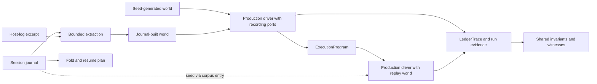

# Deterministic Simulation and Durable Session State in Motoko

> Working technical report, 2026-09-19. Implementation claims are grounded at
> `7e5ec5f9daf7d19076c2792e91701a896fc79126`. This draft distinguishes code present
> in that checkout from design decisions and validation still in progress. It
> does not report a fresh full-suite result. See [scope and evidence notes](SCOPE-current.md).

## Abstract

Motoko is a coding-agent harness whose behavior depends on model responses, tools,
extensions, operator input, and time. Its deterministic simulation framework runs
the production session driver against an explicit test world, records the
interactions that world serves, and checks structural properties of the resulting
execution. The current architecture extends this foundation across the session
lifecycle: request ordinals expose lost world-state successors, a park/wake protocol
represents external waits, and a durable journal reconstructs state for resume.
Journal-derived evaluation, partially integrated at the reported revision,
connects these records to the existing simulation harness: a journal-built world
is driven through recording adapters to produce an execution program, and
candidates replay that program under the harness's shared checks. We describe
this common path for generated and recorded workloads, and explain why
reproducibility, recoverability, and agreement with a recorded live execution are
separate claims. Coverage is stated per execution profile and per observation
boundary; replay does not establish model quality or whole-system fidelity.

## 1. The problem: testing an agent's state across boundaries

A model-driven agent is surrounded by ordinary software that must preserve
extraordinary amounts of state. A tool result must answer the correct tool call.
Compaction must preserve the required system prefix. A retry must consume its
budget. A delegated task must remain visible while the parent waits. A resumed
session must recover the history and counters that its next decision depends on.

Many failures involve a sequence of individually plausible operations. For
example, a tool adapter can return the correct result together with an updated
world, while its caller accidentally retains the old world. A subsequent request
then reads a stale cursor. Similarly, a process can produce a sensible transcript
while failing to preserve enough information for the next process to resume it.
Testing the adapter or transcript alone does not establish either property.

Motoko's approach is to make environmental responses reproducible and test the
production transition code under those responses. A simulated model is a source
of controlled replies, tool requests, errors, and timing. It is not an attempt to
reproduce a model's reasoning. Live evaluations remain useful for task outcomes;
the deterministic tests answer whether the harness handles a specified sequence
of observations correctly.

The earlier report centered on replacing environmental ports and checking a
ledger. The current system retains that architecture and adds explicit contracts
for world-state accounting, waiting, suspension, and durable reconstruction.
Project 013's ADR-004 connects live-session observations to the same recording,
replay, and checking machinery used for generated workloads. The journal supplies
the workload; an admission run establishes its checked representation in the
existing harness.

## 2. One harness for generated and journal-derived executions

The production core is written in AILANG. Its function signatures describe effect
classes, and runtime capabilities control access to those classes. The TypeScript
host manages the user interface, child-process lifetime, external wake observations,
and durable journal writing. This division matters: a deterministic test of the
core is not automatically a test of the host or operating system.

The core obtains environmental observations through `Ports`. A port takes an
explicit `WorldState` and returns a result carrying its successor. Live adapters
perform ambient operations; deterministic adapters serve a modeled world. That
world contains the state needed by the configured adapters, including scripted
responses, a virtual clock, recording and replay data, and generator state.
Extensions have a related `ExtPorts` boundary. The session driver remains the
production driver in both configurations. [Source: ports and adapters][ports].

ADR-004 brings the records into one evaluation path. The journal and an associated
host-log excerpt supply observations for a bounded test world. The production
driver runs against that world through recording adapters, producing an
`ExecutionProgram` and a `LedgerTrace`. Candidate executions then use the existing
world reconstruction, strict replay, witnesses, and invariant evaluator. A
seed-generated world enters the same recording-and-replay machinery from a
different source. This reuse is ADR-004's chosen option, O7; it replaces the
earlier proposal for a separate journal-replay verifier. [Source: ADR-004 context
and options][adr4].

The records retain complementary roles within that path:

| Record | What it represents | Role in the connected system |
|---|---|---|
| Session journal | Durable history, state updates, settings, and lifecycle boundaries across runs | Supplies resume state and, with a host-log excerpt and selector, the observations for an admission world |
| `ExecutionProgram` | Recorded environmental interactions with the manifest needed to interpret them | Captures the admission run in the existing harness format and supplies the candidate's replay world |
| `LedgerTrace` | Typed observations of a driven execution | Supplies invariant and witness evidence for both admission and candidate runs, including journal-fold consistency |

**Table 1. Journal observations become a replay program through a real driver run;
trace evidence checks both that run and subsequent candidate executions.**

**Figure 1. Generated worlds and journal-built worlds converge on the existing
recording, replay, and checking path.** The journal branch requires extraction and
admission checks against the source observations (§6); its real-entry integration
status is stated in §6.2. Resume continues to use the journal fold directly.

For journal-derived evaluation, the reproduction unit is the **corpus entry**:
journal snapshot, host-log excerpt, selector, and program, together with their
expectations and identities. The initial message history remains in the snapshot;
the program references it by digest. The program alone therefore cannot reproduce
this workload. This is how the records are married while preserving the evidence
needed to check their agreement. [Source: ADR-004 D2 and D6][adr4].

The driver has a pure decision policy in `step_machine.ail`, but substantial
effectful orchestration remains in `session.ail`. Project 013 did not replace the
whole core with a pure command generator and interpreter. Its sequencing decision
moved that work to another project, deferred a generic profile runner, and dropped
the proposed `WorldM` item. Those proposals should not be read as descriptions of
the current implementation. [Sources: decision policy][step]; [sequencing decision][adr1].

## 3. Deterministic worlds and checked state threading

### 3.1 Discovery records the environment actually encountered

In generated execution, a seeded generator responds to requests made by the real
driver. Recording adapters preserve the resulting interactions, including causal
identities, outcomes, and modeled time advances. Replay reconstructs the world
from the resulting program and checks the sequence of requests and the
consumption of recorded interactions. The program and its versioned manifest
preserve the environmental interaction sequence; reproduction also requires the
initial message and policy inputs supplied by the fixture or corpus entry. A
seed alone depends on the generator and configuration retaining their meaning.
[Sources: program representation][program];
[discovery checks][discovery]; [replay checks][replay].

Faults are modeled outcomes at environmental boundaries. A provider can return an
error; a tool can fail, disagree with its correlation identity, or complete after
a deadline. The fault catalogue states classes and recovery obligations, while
profiles disclose conditional waivers. A catalogue entry, a generated fault, and
a reached recovery branch are different pieces of evidence. The tests must
connect them before claiming coverage. [Source: fault catalogue][faults].

Time belongs to the explicit world in deterministic execution. It advances through
modeled observations, allowing deadline behavior to be exercised without waiting
for the corresponding wall-clock interval. This is a logical environment for a
session driver; it does not imply deterministic scheduling of every live delegate
process or host callback.

### 3.2 A returned successor can still be lost

Explicit state makes the dataflow visible, but ordinary record threading does
not prevent a caller from discarding a successor. Project 013 adds an ordinal and
pending request witnesses to `WorldState`. An accounted driver request advances
the ordinal and appends a witness. The session's witness function emits that
evidence before the successor can be lost at the checked handoff.

The current request classes are environment read, file read, clock read, tool
execution, model step, and wake read; approval reads are accounted under the
tool-execution class. Extension forwarding has an explicit exemption in this
driver inventory and separate coverage obligations. The ordinal is therefore not
a count of every effect in the entire process. [Sources: ordinal helper][ordinal];
[driver request inventory][inventory]; [session witness][session].

The wire checker brackets each tested invocation with an outer begin/end frame.
Within a frame beginning at ordinal \(o_0\), the request ordinals must be
\(o_0+1, o_0+2, \ldots, o_0+n\), and the returned final ordinal must equal
\(o_0+n\). The frame also requires nonempty evidence and a valid end. This catches
repeated or missing ordinals, requests outside their invocation, and disagreement
between the final returned world and the emitted witnesses. Framing matters
because several invocations can share a session identifier and restart their
ordinal sequence. [Source: framed wire checker][frames].

For example, if a caller drops a witnessed successor at ordinal 12 and makes the
next request from ordinal 11, the wire can contain 12 twice. If the last successor
is lost without another request, the frame's final-world comparison can expose
the loss. These checks localize an inconsistency; they do not, by themselves,
distinguish every possible coding error that caused it. The source inventory and
deliberately broken fixtures complement the runtime observation.

### 3.3 Missing measurements are represented explicitly

Context-limit resolution provides a smaller example of the same architectural
direction. The core distinguishes `Bounded`, `Disabled`, and `Unknown`, with the
last carrying the failed lookup reasons. Named projections serve existing integer
interfaces, and the input-budget result preserves the absence of a usable budget.
An unknown model limit is distinguishable from an explicitly disabled limit.
This makes missing measurement visible; it does not establish a universal policy
of refusing execution whenever a limit is unknown. [Source: context-limit types
and projections][limits].

## 4. Waiting and suspension are runtime states

A delegate can be working while the parent has no useful model call to make.
Repeatedly asking the model whether to continue makes that wait depend on model
behavior and consumes calls without producing new environmental information.
The current core carries open waits and can choose `Park` in its ordinary decision
policy. Wait descriptors distinguish delegated work, operator input, and timers.
A `wake_read` port supplies the next observation. The decision also respects the
step budget: exhaustion can suspend the run instead of entering another park.
[Sources: wait vocabulary][vocab]; [decision policy][step].

The live host observes answer publication, delegate state, operator input, and
timers. It correlates replies with a request, resolves simultaneous ready waits
in descriptor order, and cancels losing observers. A host transport failure and
the loss of a delegate are separate outcomes. Deterministic runs supply wake
inputs through the test world, allowing core transitions to be checked without
live delegate scheduling. [Sources: host waiter][waiter]; [park/wake fixtures][park].

This gives waiting an observable position in the session lifecycle. The core
emits park entry before blocking, handles the wake as an explicit input, and can
preserve a park in the durable journal. Dedicated fixtures test park, wake,
re-observation, and resume behavior. Their existence does not make the framework
a simulator of an entire multi-agent operating environment. The host waiter and
cross-process path have their own tests. [Sources: park/resume gate][parkresume];
[host waiter tests][waitertests].

## 5. Durable reconstruction from a session journal

The session journal outlives an individual child process. Its writer belongs to
the host, which keeps the entry sequence and parent chain across child respawns.
The child supplies typed events; it does not independently write a competing
session file. Journal entries include a header, history changes, state deltas,
run boundaries, settings, suspension/resume, park/wake, and host exit information.
[Source: host journal writer][writer].

History is recorded with message content, not just digest summaries. Appends,
replacements, and their digest rules support reconstruction after compaction or
other history changes. The journal also carries state that cannot be recovered
from conversation text alone, such as cumulative counters, token telemetry, and
extension artifacts. Live port closures and the simulation's full `WorldState`
are not serialized into the journal. Resume rebuilds the necessary runtime
machinery around reconstructed session state. [Source: journal types and fold][journal].

The fold validates the selected parent path, entry shapes, digest chain, and
tool-call pairing before constructing the state used by resume. A trailing
unanswered tool call receives explicit recovery handling so that the next
provider request does not inherit an invalid transcript. The parser also has
scoped recovery for a torn final line; corruption in the middle is not silently
treated as a valid suffix. These are concrete recovery rules, not a claim of
transactional storage durability. [Source: journal parsing and resume planning][journal].

### 5.1 The fold is checked against the driver's state

`TracedSessionResult` includes a `FinalState` comparand. The `JournalFold` invariant
constructs journal lines from journal-class trace records using an AILANG twin of
the host writer, folds those lines, and compares the recovered values against
the final state returned by the driver. The comparison would be circular if both
sides were reconstructed from the same trace; the execution bridge instead
carries the driver's final state directly. [Sources: execution bridge][execution];
[journal-fold invariant][invariants].

This is an additional consistency obligation. A trace can have valid phase
ordering while omitting a history change needed for resume. Conversely, a
recoverable journal does not establish that the execution respected tool
deadlines or replayed the expected environmental requests.

The family is registered in the common invariant evaluator, but registration
alone does not show that every scenario invokes that evaluator. Current call
sites include the stream-parity fixtures and the journal evaluator's bridges.
The host writer is separately implemented in TypeScript and separately tested;
the pure twin does not establish host persistence behavior by itself.
[Sources: stream-parity runner][stream]; [evaluation bridge][evalbridge];
[host journal tests][writertests].

## 6. Using journals as an evaluation source

ADR-004 makes journal-derived workloads use the harness's existing execution
programs and checks. Admission is the connecting step: journal and host-log
observations build the world, and a run through that world records the program.
That run also observes driver requests absent from the source journal, including
policy-initialization reads, per-dispatch timeout reads, and clock reads. Recording
the run captures those requests in the harness's own format. [Source: journal
evaluation decision, O7 and D2][adr4].

The intended path is:

1. Select a bounded segment whose journal and associated host-log observations
   satisfy the extraction rules. Refuse unsupported starts and stop at defined
   cutoffs.
2. Build a world serving the supported recorded model and tool observations,
   together with a normalized configuration.
3. Run the production core against that world through recording adapters. This
   run produces an execution program using the existing harness machinery.
4. Admit the entry only after checking its relationship to the source observations,
   its invariant results, and the provenance of the code and configuration.
5. Run an admissible candidate against the recorded program and check replay,
   witnesses, invariants, evidence counts, and transcript agreement before
   crediting a measurement.

The journal and excerpt are source evidence for admission. The resulting corpus
entry binds that evidence, the starting history, the selector, and the recorded
program for candidate runs. The ledger trace supplies independent witness
observations and invariant inputs alongside the interaction log, so matching the
program is accompanied by checks on what the driver actually emitted and returned.
At admission the invariant bridge uses `NoReplay`; candidate evaluation uses
`StrictAgainst(program.interactions)`. Both call the common harness evaluator.
[Sources: admission bridge][evalbridge]; [candidate evaluation bridge][candidatebridge].

`PortedWorld(Ports, WorldState)` supplies the explicit initial world required by
this path; the older `Ported(Ports)` entry normalizes to an empty world. This small
adapter distinction is necessary because providing the right functions does not
automatically provide the recorded state they must consume. [Sources: provider
variants][provider]; [world construction][evalworld].

### 6.1 Two kinds of agreement

Agreement with the source observations and agreement with the admitted parent
execution answer different questions. A candidate can reproduce its parent
exactly while both omit aspects of the original live session. Likewise, equality
of a history digest cannot establish equality of model parameters, tool schemas,
encoding, or every provider request field. The evaluator makes these limits
explicit instead of promoting a matching digest into a whole-request fidelity
claim. [Sources: source checks][sourcechecks]; [candidate checks][candidatechecks];
[ADR-004 fidelity ladder][adr4].

The initial tier deliberately excludes important live behavior, including
extensions, streaming, conversation-loop lifetime, and real tool execution.
It refuses continuation starts and cuts at unsupported boundaries such as retries
and parks. Later fidelity tiers are design work with additional observation
requirements. The existence of working journal resume in the runtime does not
mean the initial journal evaluator includes resumed sessions.

The proposed performance claims are similarly scoped. Allocation measurements
would concern the named simulated execution and evaluator work under a pinned
configuration. They would not measure task quality, the quality of tool choices,
provider behavior, or live end-to-end latency. The trust model assumes cooperative,
reviewed candidates: pinned evaluator files and protected regions help detect
ordinary drift, but do not prove the integrity of evidence returned by an
adversarially modified core. [Source: ADR-004 claims and trust model][adr4].

### 6.2 Status at the reported revision

The checkout contains the reader, admission machinery, evaluator bridges,
candidate checks, synthetic fixtures, and runner. It does **not** yet expose an
operational real-entry admission path in that runner: `mode_admit` routes
`RealEntry` to `jr_real_refused`, and candidate mode also rejects real-entry input.
Project records describe subsequent work in a separate evaluator worktree and
sweep clones. That work is outside this report's implementation snapshot.
[Sources: evaluator runner][evalrunner]; [September 17 handoff][evalhandoff].

Consequently, this draft describes the integrated machinery and the accepted
evaluation design, but reports no admitted live corpus, completed performance
gate, or measured improvement from that gate. This section must be re-grounded
when the follow-up work is integrated and validated.

## 7. Conformance, coverage, and the limits of a green result

### 7.1 Profiles define what is under test

Motoko scopes generated-axis DST claims to an execution profile. Fixed scripted
scenarios remain valuable deterministic regression tests, but are not thereby
seeded simulation coverage. A profile identifies the installed extension set,
covered capabilities, exclusions, fault waivers, attribution, and the evidence
supporting those claims. [Sources: profile schema][profiles];
[coverage model][coverage].

At this source snapshot, four profile definitions are present:

| Profile | Declared version | Scope relevant to this report |
|---|---:|---|
| `driver_only` | 32 | No installed extensions; no extension coverage follows from its acceptance. |
| `driver_plus_no_ops` | 21 | Four selected extensions with coverage accounted over their registered capability atoms. |
| `driver_plus_compose` | 13 | Compose coverage with substantive response-interceptor evidence and explicit exclusions. |
| `driver_plus_herdr` | 2 | Herdr delegation coverage; two entries are classified as substantively world-mediated, while `exit_intent[0]` is excluded. |

**Table 2. Four versioned declarations exist; this inventory is not a fresh
four-profile conformance result.** Sources: [driver-only][driveronly],
[no-ops][noops], [compose][compose], and [herdr][herdr] definitions.

The August report's one-of-forty aggregate was a dated measurement of a different
population. The current profile code accounts for capability atoms, identified by
kind and index, and includes herdr's additional classifications. Reusing the old
denominator would misrepresent current coverage. A new aggregate requires a new
fold over current profile output, retaining the distinction between a declared
effect-free entry, a measured entry, and a substantive exercise of the world.

### 7.2 Effect capabilities have a precise scope

Withholding a capability can detect an attempted ambient effect in the class it
controls. Poison pairs strengthen that observation by checking that a deterministic
world can run without the capability while a corresponding ambient operation
cannot. But granting a capability to a process does not prove that every operation
using it passes through the intended port.

This matters for extension registration. The compose and herdr profiles disclose
ambient registration reads and the resulting capability grants. Their recorded
executions and replay comparisons support the particular exercised behavior;
they do not turn those grants into a universal hermeticity guarantee. A static
inventory, a withheld-capability run, and dynamic interaction evidence each
support different claims. [Sources: compose disclosures][compose];
[herdr disclosures][herdr]; [world poison probe][poison].

### 7.3 Invariant availability and exercised evidence differ

The common evaluator registers thirteen single-execution invariant families:
terminal summary, emission parity, phase transitions, tool pairing, budget
accounting, bounded progress, checkpoint history, outcome agreement, replay
consistency, world transitions, virtual time, harness hygiene, and journal fold.
The determinism comparison is a separate relation over two executions.
[Source: invariant definitions and evaluator][invariants].

Family evidence records whether an obligation was evaluated and the size of its
input. This helps expose checks that pass over empty input. It must be read beside
the runner's actual call sites, the profile's exclusions, and the reached fault
branches. A family being available does not mean every test ran it; a recovery
branch being reached does not establish that every incorrect result on that
branch would be detected.

The test stack also includes pure policy and codec tests, fixed driver scenarios,
generated discovery/replay checks, wire-level comparisons, source inventories,
host tests, and selected cross-process checks. The larger `make dst` sweep and the
checked-in CI workflow have different target lists. In particular, the workflow
invokes an explicit subset and separate seeded and L2 commands. Its seeded command
uses five seeds for ordinary runs and 500 for scheduled runs; those settings are
not counts for every generated corpus in the repository. [Sources: Makefile][make];
[CI workflow][ci].

## 8. Evidence and remaining limits

This is an architecture report based on source inspection, existing implementation
records, and two lightweight checker validations. During drafting, the framed-wire
checker's synthetic selftest passed, including its deliberately invalid frames.
The driver-leaf inventory selftest reported zero failures, detected its deliberate
mutations, and classified the unmutated tree as 26 clean/returned leaves and six
clean receipts. These observations establish behavior of those checkers under
their tests. They are not a fresh production-driver sweep or an estimate of bug
detection rates. [Commands and scope: evidence notes](SCOPE-current.md).

Several limits shape the interpretation of the architecture:

- **The simulation boundary is incomplete.** Ambient registration and the
  TypeScript host need their own evidence. A modeled wake is not a simulation of
  all delegate processes, filesystem notifications, and host scheduling.
- **Recoverability is a new obligation.** The fault catalogue lists crash recovery
  and resume-from-ledger as triggers for reconsidering physical-fault exclusions.
  Durable resume now exists. Journal parsing and resume fixtures address concrete
  damaged or interrupted states, but a systematic claim about crash points,
  repeated crashes, or storage durability needs a separate coverage account.
- **Replay fidelity is bounded.** A supported journal segment can become a useful
  deterministic workload without representing the full live execution. The
  evaluator must retain its cutoff rules and omissions in any reported result.
- **Oracle sensitivity remains an empirical question.** The repository has targeted
  negative tests and mutation checks. This drafting pass does not establish a
  systematic mutation score across all invariant families or a cumulative
  production bug-yield result.
- **Current conformance needs current runs.** Profile versions, source pins, and
  gate membership change. Neither a profile definition nor an earlier sweep
  certifies the publication revision.

These limitations also identify the next useful measurements: a pinned full
sweep, current capability-coverage accounting, journal recovery coverage, and
validated admission of the evaluator's supported workload. Expanding the report's
claims should follow those measurements.

## 9. Conclusion

Motoko's current testing architecture connects reproducible environmental
interactions with explicit runtime lifecycle and durable session state. The
production core runs against replaceable ports; recorded programs support replay;
ordinals and wire witnesses check state threading; and a journal fold checks
whether emitted history and state changes reconstruct the driver's result.
Park/wake and resume add behaviors that require evidence beyond a single completed
agent loop.

Journal-derived evaluation joins live-session records to this same harness through
an admission run and a corpus entry binding the source observations to the replay
program. At the reported revision, its integrated synthetic
machinery and accepted design are ahead of its operational real-entry path.
Generated and journal-derived workloads thus share recording, replay, and checks,
with additional source-fidelity obligations at the admission boundary. Durable
resume retains its direct fold over the journal.

<!-- Repository sources are relative so the draft remains navigable in a checkout. -->
[ports]: ../../src/core/ports.ail
[session]: ../../src/core/session.ail
[step]: ../../src/core/step_machine.ail
[vocab]: ../../src/core/phase_vocab.ail
[program]: ../../src/core/dst_program.ail
[discovery]: ../../src/core/dst_discovery.ail
[replay]: ../../src/core/dst_replay.ail
[faults]: ../../src/core/dst_fault_catalogue.ail
[ordinal]: ../../src/core/world_ordinal.ail
[inventory]: ../../tools/driver_leaf_inventory/derive.py
[frames]: ../../scripts/dst/run_world_framed_wire.sh
[limits]: ../../src/core/context_limit.ail
[waiter]: ../../src/tui/src/wake-waiter.ts
[waitertests]: ../../src/tui/src/wake-waiter.test.ts
[park]: ../../scripts/dst/park_wake_dst.ail
[parkresume]: ../../scripts/dst/run_park_resume.sh
[writer]: ../../src/tui/src/session-journal.ts
[writertests]: ../../src/tui/src/session-journal.test.ts
[journal]: ../../src/core/journal.ail
[execution]: ../../src/core/dst_execution.ail
[invariants]: ../../src/core/dst_invariants.ail
[stream]: ../../scripts/dst/stream_parity_dst.ail
[provider]: ../../src/core/test/stub_step.ail
[evalworld]: ../../src/eval/journal/world.ail
[evalbridge]: ../../src/eval/journal/bridge.ail
[sourcechecks]: ../../src/eval/journal/source_checks.ail
[candidatechecks]: ../../src/eval/journal/candidate_checks.ail
[candidatebridge]: ../../src/eval/journal/candidate_checks_run.ail
[evalrunner]: ../../scripts/eval/journal_replay.ail
[profiles]: ../../src/core/dst_profile.ail
[coverage]: ../../src/core/dst_profile_coverage.ail
[driveronly]: ../../src/core/dst_driver_only.ail
[noops]: ../../src/core/dst_driver_plus_no_ops.ail
[compose]: ../../src/core/dst_driver_plus_compose.ail
[herdr]: ../../src/core/dst_driver_plus_herdr.ail
[poison]: ../../scripts/dst/world_state_poison.ail
[make]: ../../Makefile
[ci]: ../../.github/workflows/verify-extensions.yml
[adr1]: ../../.agent/projects/013_core_architecture_for_dst/ADR-001-sequencing-the-dst-architecture-caps.md
[adr4]: ../../.agent/projects/013_core_architecture_for_dst/ADR-004-journal-as-evaluation-source.md
[evalhandoff]: ../../.agent/projects/013_core_architecture_for_dst/HANDOFF-2026-09-17-plan004-post-p1g-p22-blocked.md
